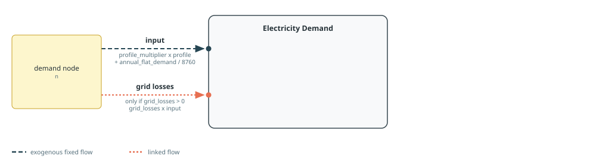
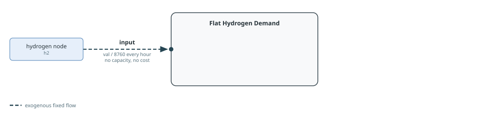
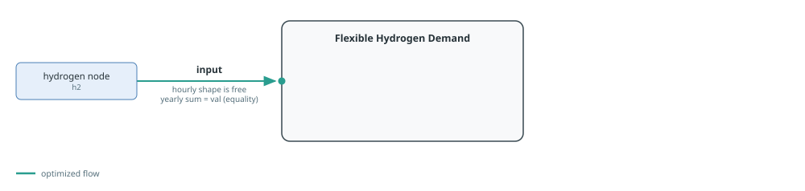
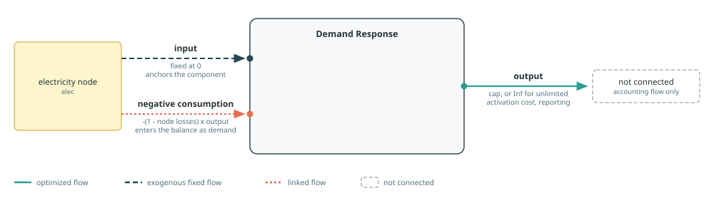

# Demand And Flexibility

Demand-side builders cover fixed consumption, annually constrained flexible
consumption, and virtual demand response. All components are created and
connected immediately. Electric vehicles are covered separately in
[Electric Vehicles](electric-vehicles.md).

See [Component Builders](../components.md) for shared naming, workbook, cost,
capacity, and port conventions, and [Tags And
Post-Processing](../concepts/tags.md) for tagging and reporting.
Each section's diagram follows the conventions in [Reading The Port
Diagrams](../components.md#Reading-The-Port-Diagrams).

## Electricity Demand

[`makedemand`](@ref) creates a fixed Nosy demand with the name
`"$name $(n.name)"`. Its `input` profile is

```math
d_t = c p_t + D / 8760,
```

where `c` is `profile_multiplier`, `p_t` is the workbook series selected by `zone`, and `D`
is `annual_flat_demand`. `profile_shift_hours` circularly shifts the workbook series before the
flat term is added. Setting `profile_multiplier=0` suppresses the workbook lookup, which is
useful for self-contained examples and purely flat demand.

When `grid_losses` is non-zero, the builder adds a linked `grid losses` input
proportional to demand. The value must lie in `[0, 1)`.



Tags: `:tech => tech`, `:zone => n.name`, and the function tags `electricity`
and `demand`.

The workbook series is read from sheet `demand`, column `<zone>`. With the
standard hourly MW/MWh convention, `annual_flat_demand` is in MWh/year.

See the [One Country example](../examples/one-country.md) for a complete model
using this builder.

```@docs; canonical=false
makedemand
```

## Hydrogen Demand

[`makeflathydrogendemand`](@ref) creates a fixed `input` of `annual_demand / 8760` at a
hydrogen node. [`makeflexhydrogendemand`](@ref) instead creates a flexible
`input` whose sum over the model year must equal `annual_demand`. Both builders therefore
take an annual hydrogen-energy quantity, but only the flat builder fixes its
hourly shape.

The generated name is `"$name $(n.name)"`. They do not read a workbook and do
not add a cost or capacity behaviour.





Tags for both builders: `:tech => tech`, `:zone => n.name`, and the function
tags `hydrogen` and `demand`.

```@docs; canonical=false
makeflathydrogendemand
makeflexhydrogendemand
```

## Demand Response

[`makedemandresponse`](@ref) represents demand response as negative
consumption at the electricity node. Its positive `output` is an unconnected
accounting flow used for capacity, activation cost, and reporting. A linked
`negative consumption` input equal to
`-(1 - elec.losses) * output` is connected instead, so the existing consumption
components remain unchanged while demand response enters the nodal balance
from the demand side. With zero node losses this is exactly `-output`. A
numeric `cap` adds fixed response capacity, a JuMP variable or affine
expression reuses an external response-capacity decision, `nothing` creates a
new response-capacity decision, and `Inf` leaves response output unlimited.
Because these last two cases are easy to confuse, `cap=nothing` emits a warning
suggesting `cap=Inf` when unlimited capacity was intended.



`cost` is the activation cost per unit of the positive `output` flow and is
applied directly. `type` selects the variable-cost category used by reports
and defaults to `:volDR`.

The generated component is named `"$name $(elec.name)"`.

Tags: `:tech => tech`, `:zone => elec.name`, and the function tags `virtual`
and `demandresponse`.

See the [Demand Response example](../examples/demand-response.md) for a complete
model using this builder.

```@docs; canonical=false
makedemandresponse
```
