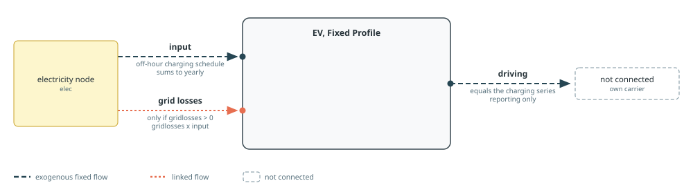
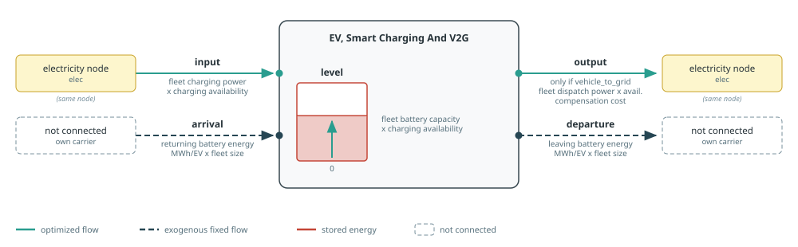

# Electric Vehicles

[`makeEV`](@ref) creates fixed or flexible electric-vehicle demand. See
[Component Builders](../components.md) for shared naming, workbook, and port
conventions, and [Tags And Post-Processing](../concepts/tags.md) for tagging
and reporting. Each mode's diagram follows the conventions in [Reading The Port
Diagrams](../components.md#Reading-The-Port-Diagrams).

!!! warning "Unstable EV API"
    The EV API is not fixed yet. The modes, keyword arguments, component and
    port structure, and reporting semantics may change substantially in later
    Posy2 versions.

Exactly one of `fixed_profile`, `smart_charging`, and `vehicle_to_grid` must be
true.

## Fixed Profile

The fixed mode creates a conventional demand component. `offhours1` and
`offhours2` give zero-based hours of day for the winter and summer patterns;
`minratio` scales demand in those hours. `days_threshold` locates the boundary
between the first winter segment and summer. The generated 365-day profile is
normalised to the annual consumption `yearly`, so its hourly values always sum
to `yearly` exactly. Off-hour indices must be unique, and a schedule leaving no
charging hour at all (every hour an off-hour with `minratio=0`) is rejected.

This mode requires `offhours1`, `offhours2`, and `minratio`, but performs no
workbook lookup. It can add the same proportional `grid losses` port as
[`makedemand`](@ref).



```julia
makeEV(
    "EV", electricity, snapshot;
    yearly=50_000.0,
    fixed_profile=true,
    smart_charging=false,
    vehicle_to_grid=false,
    offhours1=0:5,
    offhours2=0:5,
    minratio=0.2,
)
```

## Smart Charging And Vehicle To Grid

The flexible modes represent the connected fleet as storage. `number_ev` sets
fleet size and scales per-vehicle power and battery limits.
`initial_connected_share` is the share of the fleet connected immediately before
the first model timestep.

Mobility is defined each hour by:

- `departures` and `arrivals`: nonnegative vehicle counts;
- `departure_soc` and `arrival_soc`: mean state of charge in `[0, 1]`.

Departing and arriving battery energy use

```math
\begin{aligned}
D_t &= \mathrm{departures}_t \times \mathrm{departure\_soc}_t \times \mathrm{battery\_capacity\_per\_ev} \\
A_t &= \mathrm{arrivals}_t \times \mathrm{arrival\_soc}_t \times \mathrm{battery\_capacity\_per\_ev}
\end{aligned}
```

The connected count at the start of hour `t` and charging availability follow

```math
\begin{aligned}
n_1 &= \mathrm{initial\_connected\_share} \times \mathrm{number\_ev} \\
n_{t+1} &= n_t - \mathrm{departures}_t + \mathrm{arrivals}_t \\
a_t &= n_t / \mathrm{number\_ev}
\end{aligned}
```

On a circular mesh, annual departure and arrival counts must balance (`sum(departures) = sum(arrivals)`).
Charging availability `a_t` applies as a capacity multiplier on `input`, `level`, and (in vehicle-to-grid mode)
`output`.

Per-vehicle technology parameters come from the column named by `techkey` in
the `storage` sheet: `charging_eff`, `self_discharge`, `max_charging_power`,
`max_dispatch_power`, and `battery_capacity`. Each has a corresponding keyword
override. `max_dispatch_power` is resolved only in vehicle-to-grid mode; smart
charging does not require it.

In `tech_mode=:arguments`, charging efficiency defaults to one and
self-discharge to zero. Maximum charging power and battery capacity remain
structural and must be supplied; vehicle-to-grid additionally requires maximum
dispatch power. In `timeseries_mode=:arguments`, `departures`, `arrivals`,
`departure_soc`, and `arrival_soc` must also be supplied explicitly. In
`timeseries_mode=:excel`, omitted mobility series are read for `zone` from
`EV_departure`, `EV_arrival`, `EV_departure_soc`, and `EV_arrival_soc`.

Smart charging exposes a flexible `input`, a `level`, fixed unconnected
`departure` and `arrival` ports, and a reporting only `driving` output
(`departure - arrival`). Vehicle-to-grid mode also
exposes `output`, limited by available dispatch power, and applies
`compensation` as a variable output cost.



Tags for all EV modes: `:tech => cname`, `:zone => elec.name`, and the function
tags `electricity`, `demand`, and `ev`. Vehicle-to-grid mode also receives the
function tag `generation`, so its discharge appears in production reporting.

!!! note
    EV profiles currently use a 365-day, 8,760-hour convention. Use a full
    non-leap-year hourly mesh for these modes.

See the [Electric Vehicles example](../examples/electric-vehicles.md) for smart
charging and vehicle-to-grid models using this builder.

```@docs; canonical=false
makeEV
```
