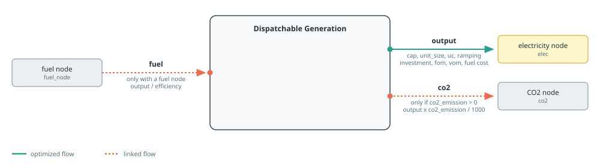
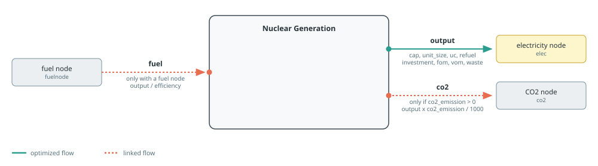
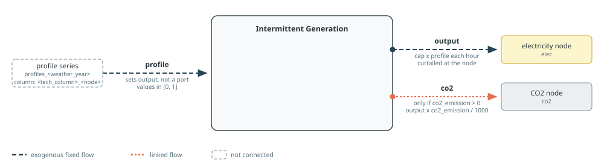
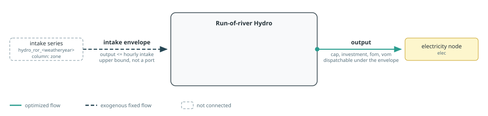

# Generation

Generation builders create dispatchable, nuclear, intermittent, and hydro
sources. Costed electricity sources attach annualised investment and
decommissioning costs, fixed operation and maintenance, and the applicable
variable costs.

See [Component Builders](../components.md) for shared naming, workbook,
capacity, and port conventions, and [Tags And
Post-Processing](../concepts/tags.md) for tagging and reporting.
Each section's diagram follows the conventions in [Reading The Port
Diagrams](../components.md#Reading-The-Port-Diagrams).

## Dispatchable Generation

[`makedispatchable`](@ref) creates a source named
`"$name $(elec.name)"`. Its principal port is electricity `output`, and its
investment, connection, fixed O&M, decommissioning, variable O&M, and direct
fuel costs are attached there.

In `tech_mode=:excel`, common technical and economic defaults come from the
technology column named by `tech_column` in sheet `dispatchable`. In
`tech_mode=:arguments`, additive costs and emissions default to zero, linked
fuel defaults to lossless efficiency, and unit sizing and ramping default to
disabled. Capital lifetime and profiles are required only when their associated
cost is active. A numeric `cap` fixes output capacity; a JuMP variable or affine
expression reuses an external capacity decision; `nothing` creates a new
decision; and an extracted snapshot inherits the matching component's capacity.
`mincap` and `maxcap` bound either variable form. Numeric `cap=0` builds a
zero-capacity component.
`capacity_multiplier` can impose a time-varying availability on output.

If `fuelnode` is absent, `fuel_cost` is a variable cost on electricity output.
If a fuel node is supplied, the builder instead creates a `fuel` input equal to
electricity output divided by `efficiency`. Non-zero `co2_emission` adds a
linked `co2` output and connects it to the CO2 node; `co2_price` prices that
flow.



Setting `uc=true` adds unit commitment, no-load cost, and start-up cost.
Passing an extracted snapshot as `uc` instead replays the commitment schedule
already solved for that component, and then requires a fixed `cap`.
`integer_uc` selects continuous or integer commitment. The minimum power,
up-time, down-time, start-up duration, and shut-down duration default to rows in
the same workbook column. When `unit_size` is positive, non-zero `ramp_up` and
`ramp_down` values add ramp limits after multiplication by the unit size.

Tags: `:tech => tech`, `:zone => elec.name`, and the function tags `generation`
and `dispatchable`.

See the [Dispatchable Generation example](../examples/dispatchable-generation.md)
for a complete model using this builder.

```@docs; canonical=false
makedispatchable
```

## Nuclear Generation

[`makenuclear`](@ref) uses the same `dispatchable` sheet and the same principal
electricity, fuel, and CO2 ports. It adds `waste_cost`, supports integer
capacity with `integer_cap`, and accepts `warmstart` for a capacity decision.
Ramping follows [`makedispatchable`](@ref): non-zero `ramp_up` and `ramp_down`
values are multiplied by `unit_size`. They default to inactive in `:arguments`
mode; in `:excel` mode, omitted values come from the technology column.



Fresh unit commitment may include planned refuelling outages. Refuelling is
active only when `refuel=true`, `uc=true`, `refuel_fraction_per_year` is
positive, and `refuel_duration` is positive. Set `refuel=false` to disable it
without reading or validating the other refuelling arguments. When active,
`refuel_slot_spacing` must be supplied by the caller as a positive `Integer`. It
spaces the grid of time steps at which an outage may start, so `8760` leaves a
single allowed start and `730` leaves about twelve. In
`:excel` mode, refuel fraction and duration default to the `dispatchable`
technology column. In `:arguments` mode they default to zero, disabling
refuelling outages; `refuel_slot_spacing` has no workbook default. Supplying refuelling
arguments with `uc=false` emits a warning and does not add refuelling
constraints. A replayed UC schedule retains the outages it was solved with;
explicit refuelling arguments emit a warning and are ignored. Economic terms
and emissions also default to zero in `:arguments` mode.

Capacity follows the common numeric, external-expression, `nothing`, and
inherited-from-a-snapshot semantics. For an external expression, `mincap` and
`maxcap` constrain that expression. Nosy does not allow `warmstart` with an
external expression. With `integer_cap=true`, a `VariableRef` is made integer,
whereas an `AffExpr` is rejected. In particular, `unit_size` does not make an
external variable a number-of-units variable; represent that explicitly as
`unit_size * integer_units` when unit-block integrality is required.

Refuelling constraints do not depend on `tech_column`. They assume an 8,760-hour
model horizon, so use them only for a full non-leap-year study.

Tags: `:tech => tech`, `:zone => elec.name`, and the function tags `generation`
and `dispatchable`. Direct emissions are controlled by `co2_emission`; the
builder does not infer a `carbonfree` tag from the technology name.

See the [Nuclear example](../examples/nuclear.md) for models using this builder
with forced and flexible refuelling schedules.

```@docs; canonical=false
makenuclear
```

## Intermittent Generation

[`makeintermittentsource`](@ref) creates a profile source. It reads availability
from sheet `profiles_<weather_year>`, column
`<tech_column>_<electricity-node-name>`. The profile multiplies the `output` capacity.
Workbook lookup requires an explicit `weather_year`; the keyword defaults to
`nothing` and is unused when `profile` is supplied directly.



Numeric `cap` fixes capacity; a JuMP variable or affine expression reuses an
external capacity decision; `nothing` creates a new decision; and a solved
snapshot inherits the named component's capacity. `mincap` and `maxcap` bound
either variable form. In `:excel` mode,
technical and cost defaults come from the technology column named by `tech_column`
in sheet `intermittent`. In `:arguments` mode, costs and emissions default to
zero and inactive capital data are not required. The production profile
remains structural whenever capacity is active.
Non-zero emissions create the same linked CO2 flow as for dispatchable
generation.

Tags: `:tech => tech`, `:zone => elec.name`, and the function tags `generation`
and `intermittent`. The component also receives the function tag `carbonfree`
when `co2_emission` is zero.

See the [Dispatchable Generation example](../examples/dispatchable-generation.md)
for a model that co-optimises intermittent and dispatchable capacity.

```@docs; canonical=false
makeintermittentsource
```

## Run-of-river Hydro

[`makehydroror`](@ref) reads an intake shape from sheet
`hydro_ror_<weather_year>`, column `<zone>`. The builder normalizes the shape to
sum to one, distributes `intake` over it, and limits hourly output by both that
intake envelope and installed capacity.
Workbook lookup requires an explicit `weather_year`; the keyword defaults to
`nothing` and is unused when `intake_profile` is supplied directly.



In `:excel` mode, cost defaults come from the technology column named by
`tech_column` in sheet `intermittent`; the default column name is `Hydro ror`. In
`:arguments` mode costs default to zero and inactive capital data are not
required. A numeric `cap` fixes output capacity; `cap=nothing` creates a new
capacity decision; and a JuMP variable or affine expression reuses an external
decision. `mincap` and `maxcap` bound either variable form. The intake profile
remains independent of capacity.

Tags: `:tech => tech`, `:zone => elec.name`, and the function tags `generation`,
`intermittent`, and `carbonfree`.

```@docs; canonical=false
makehydroror
```

## Note On Capacity And Unit Commitment

`unit_size` is the output of one physical unit. Unit commitment uses it to
express commitment, startup, and shutdown in numbers of units, so every enabled
UC formulation requires a positive `unit_size`. A fixed capacity used with
`integer_uc=true` must be an integer multiple of `unit_size`.

The `uc` and `integer_uc` combinations have these effects:

| Arguments | Formulation |
|:----------|:------------|
| `uc=false` | No UC equations or UC costs; `integer_uc` and UC operating arguments have no effect |
| `uc=true, integer_uc=false` | Fresh UC equations with continuous, relaxed commitment variables |
| `uc=true, integer_uc=true` | Fresh UC equations with integer commitment, startup, and shutdown variables |
| `uc=<extracted snapshot>` | Replays the solved commitment schedule and requires `cap` to be fixed by a number or snapshot |

`integer_cap` is supported by [`makenuclear`](@ref). With `cap=nothing`, a
positive `unit_size` makes the new capacity decision a number of units and
`integer_cap=true` makes that count integer. With an external `VariableRef`, the
supplied variable itself is made integer; `unit_size` does not reinterpret or
scale it. An external `AffExpr` cannot be made integer and is rejected. To
share unit-block capacity, create an integer unit-count variable and pass
`unit_size * integer_units` explicitly. Fixed and inherited capacities contain
no capacity decision, so `integer_cap` and `warmstart` have no effect on them.
`warmstart` applies only to a new capacity decision and is rejected for an
external expression.

`integer_cap` and `integer_uc` are independent. If both are enabled for a new
nuclear capacity with fresh UC, both the capacity unit count and the hourly UC
variables are integer; Posy2 does not drop either integrality condition as a
simplification.

For fresh `uc=true`, `min_power`, `min_uptime`, `min_downtime`,
`startup_duration`, and `shutdown_duration` configure the UC equations.
Nuclear `startupmask` and `shutdownmask` also apply only to fresh UC. A replayed
schedule already contains those choices, so these operating arguments and
`integer_uc` do not alter it. `no_load_cost` and `startup_cost` are attached
whenever UC is enabled, including replayed UC. For [`makedispatchable`](@ref)
and [`makenuclear`](@ref), ramping is separate from UC: non-zero `ramp_up` or
`ramp_down` adds a limit whenever `unit_size` is positive, even with `uc=false`.
After workbook defaults and explicit overrides are resolved, zero or `nothing`
omits that limit.
