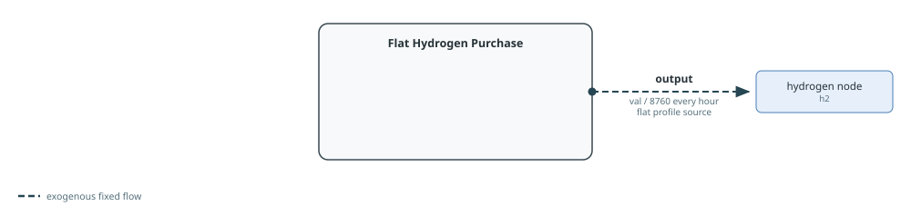
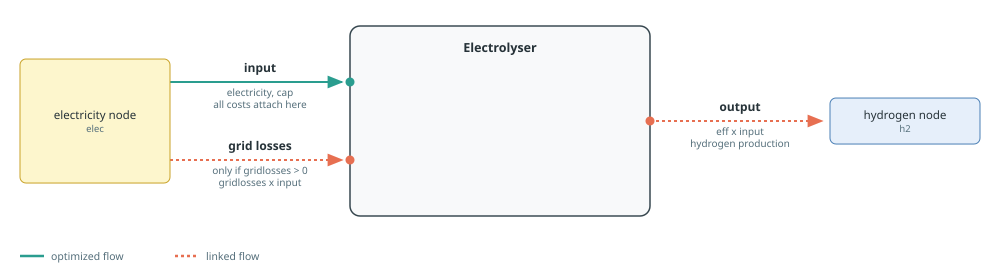
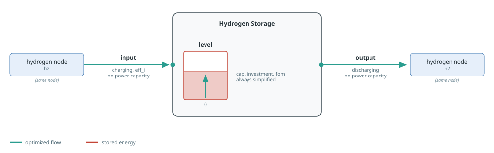

# Hydrogen

Hydrogen can be supplied exogenously, produced from electricity, and moved
across time. Hydrogen demand builders are documented on the [Demand And
Flexibility](demand.md) page.

See [Component Builders](../components.md) for shared naming, workbook,
capacity, and port conventions, and [Tags And
Post-Processing](../concepts/tags.md) for tagging and reporting.
Each section's diagram follows the conventions in [Reading The Port
Diagrams](../components.md#Reading-The-Port-Diagrams).

## Purchased Hydrogen

[`makeflathydrogenpurchase`](@ref) represents an exogenous hydrogen supply. It
creates fixed `output` capacity `val / 8760` with a constant profile, so `val`
is the total annual hydrogen-energy purchase. It reads no workbook and adds no
cost. Add an explicit Nosy cost behaviour when purchases should affect the
objective.



The generated name is `"$cname $(n.name)"`.

Tags: `:tech => cname`, `:zone => n.name`, and the function tags `hydrogen` and
`purchase`.

```@docs; canonical=false
makeflathydrogenpurchase
```

## Electrolysers

[`makeelectrolyser`](@ref) creates a converter with electricity `input` and
hydrogen `output`. The output-to-input ratio is `eff`. In `:excel` mode,
omitted values come from the `electrolysis` technology column. In `:arguments`
mode, `eff` defaults to one and costs to zero; lifetime and construction data
are required only for nonzero overnight cost, and the decommissioning profile
only when decommissioning cost is active.



Capacity and all cost behaviours are attached to electricity `input`. A
numeric `cap` fixes input power; a JuMP variable or affine expression reuses an
external decision; `nothing` creates a new decision; and an extracted snapshot
fixes capacity from the matching component. `mincap` and `maxcap` bound either
variable form. `gridlosses` adds a proportional electricity input flow.

The generated name is `"$cname $(elec.name)"`.

Tags: `:tech => cname`, `:zone => elec.name`, and the function tags `demand`,
`electrolysis`, and `hydrogen`. These tags allow electrical consumption to
appear in demand reporting.

See the [Hydrogen Production example](../examples/hydrogen-production.md) for a
complete model using this builder.

```@docs; canonical=false
makeelectrolyser
```

## Hydrogen Storage

[`makehydrogenstorage`](@ref) creates a simplified storage component on a
hydrogen node. Capacity is attached to `level`, not to charge or discharge
power. A numeric `cap` fixes level capacity; a JuMP variable or affine
expression reuses an external decision; `nothing` creates a new decision; and
an extracted snapshot inherits the matching component's level capacity.
`mincap` and `maxcap` bound either variable form.



In `:excel` mode, omitted values come from the `storage` technology column. In
`:arguments` mode, `eff` defaults to one and economic terms to zero; inactive
capital and decommissioning data are not required. Investment, fixed O&M, and
decommissioning are attached to `level`. The builder intentionally adds
neither a duration constraint nor a variable O&M cost, making it suitable for
medium- or long-duration storage whose power is not sized separately.

The component is named `"$cname $(h2.name)"`.

Tags: `:tech => cname`, `:zone => h2.name`, and the function tags `hydrogen`
and `storage`.

See the [Hydrogen Production example](../examples/hydrogen-production.md) for a
complete model using this builder.

```@docs; canonical=false
makehydrogenstorage
```

Related demand builders: [`makeflathydrogendemand`](@ref) and
[`makeflexhydrogendemand`](@ref).
