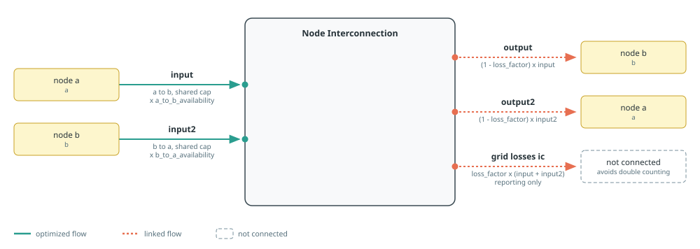
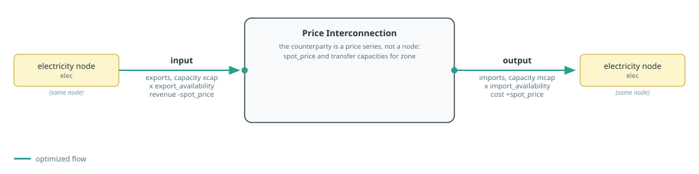

# Interconnections

Posy2 offers two representations of cross-zone exchange. A node
interconnection connects two explicit model nodes. A price interconnection
represents an external market through import and export capacities and an
exogenous price series.

See [Component Builders](../components.md) for shared capacity and port
conventions, [Tags And Post-Processing](../concepts/tags.md) for tagging and
reporting, and [Input Workbooks](../concepts/input-data.md) for the
transfer-capacity and price sheets.
Each section's diagram follows the conventions in [Reading The Port
Diagrams](../components.md#Reading-The-Port-Diagrams).

## Direction And Transfer Multipliers

Price interconnections have separate import and export base capacities. Node
interconnections instead have one installed `cap` shared by both directions.
Their two hourly multipliers express directional available transfer capacity
against that shared rating. In `timeseries_mode=:excel`, an omitted multiplier
is read from the sheet that belongs to the builder and link type; in
`:arguments` mode it defaults to one.

| Builder | Sheet |
|:--------|:------|
| [`makepricelink`](@ref) | `transfer_capacities` |
| [`maketransmissionlink`](@ref), `dc=false` | `transfer_capacities_AC` |
| [`maketransmissionlink`](@ref), `dc=true` | `transfer_capacities_DC` |

Splitting the node sheets by link type lets an AC and a DC link on the same node
pair carry their own availability, and keeps both separate from the priced
corridors. In every sheet the column is named for the direction, written as
`From>To` with no spaces. Effective capacity is the base capacity multiplied by
that series. The values are therefore fractions or other multipliers, not
absolute MW capacities.

Setting a node interconnection's shared `cap` to numeric zero skips both
multiplier lookups. An optimized or externally supplied capacity resolves both
directions because its value is not known while the component is built. Set a
directional multiplier to zero to disable that direction. Price interconnections
retain their separate directional-capacity behavior, and skip a direction's
lookup when that direction's capacity is a fixed zero.

For a price interconnection, `exclusive_direction=true` adds an SOS1 constraint at every
timestep so that imports and exports cannot be used simultaneously. For a
node interconnection, `exclusive_direction=true` likewise constrains the two sending ports
(`input` and `input2`) so that only one direction can be positive in a given
hour. This may require solver support beyond a plain continuous LP.

## Node Interconnections

[`maketransmissionlink`](@ref) names the component
`"$(name)_$(a.name)_$(b.name)"`. Its first direction is `a -> b`:

- `input` withdraws from node `a` and carries the shared `cap` multiplied by
  `a_to_b_availability`;
- `output` delivers to node `b` after `loss_factor`.

The reverse direction is `b -> a`:

- `input2` withdraws from node `b` and carries the same `cap` multiplied by
  `b_to_a_availability`;
- `output2` delivers to node `a` after `loss_factor`.



`loss_factor` must be finite and lie in `[0, 1)`. Each delivered flow is its
sending flow multiplied by `1 - loss_factor`; invalid factors are rejected
before model construction.

The endpoints must be distinct. Self-connections and generated-name
collisions are rejected before the builder creates component variables or
directional SOS constraints.

Exactly one `AC` and one `DC` may share the same unordered node pair
(either, both, or neither is fine). A second `AC` or a second `DC` on
that pair raises an error. Aggregate equivalent parallel circuits
before calling the builder.

`cap` follows the common component capacity contract: `nothing` optimizes it, a
number fixes it, a JuMP variable or affine expression is reused, and an
extracted snapshot inherits it. `mincap` and `maxcap` bound an optimized or
reused capacity and assert against a fixed or inherited value.

The `input` and `input2` capacity behaviors reference the same number or JuMP
affine expression. Nosy applies each directional constraint and multiplier,
but there is only one capacity value and therefore one investment decision.

Annualized `overnight_cost` and annual `om_fixed_cost` are attached once to the
shared capacity. `transaction_cost` is applied to each direction's sending
flow. The unconnected `grid losses ic` output records proportional losses for
reporting.

Tags: `:zone => a.name`, `:zone => b.name`, and the function tags
`interconnection`, `nodeinterconnection`, and either `AC` or `DC`. There is no
component-level foreign tag: a node interconnection counts as foreign in
reports exactly when at least one of its endpoints is a node tagged
`:foreign`. Give nodes the appropriate `:electricity` and `:foreign` tags for
self-versus-foreign reports.

### DC Power-flow Metadata

Here `dc` classifies the interconnector for Kirchhoff voltage-law constraints;
it does not make the link unidirectional. `dc=false` creates an AC-classified
link, while `dc=true` excludes it from the cycle constraints added by
[`applydcopf!`](@ref).

When DC power flow is enabled in [`Posy2Options`](@ref), every AC node
interconnection must supply a negative series `susceptance`
(``B\approx-1/X`` for inductive lines). The builder stores it in the
snapshot's internal registry. Call [`applydcopf!`](@ref) after adding all
links and before optimisation; once it has run, the node interconnections are
frozen and a further `maketransmissionlink` call raises an `ArgumentError`. See
[Optimising A Snapshot](../concepts/optimizing.md) for the complete workflow.

See the [Two Countries example](../examples/two-countries.md) for a transport
link, and the [DC OPF example](../examples/dc-opf.md) for AC and DC networks
with Kirchhoff voltage-law constraints.

```@docs; canonical=false
maketransmissionlink
```

## Price Interconnections

[`makepricelink`](@ref) creates `"$(name)_$(elec.name)"` without creating
an explicit node for the neighbouring market. Imports use component `output`,
base capacity `import_cap`, multiplier column `neighbor_column>local`, and
the neighbour's `spot_price` series. Exports use component `input`, base
capacity `export_cap`, and multiplier column `local>neighbor_column`.
Export energy earns the same exogenous spot price; `transaction_cost` is added in
both directions.

The counterparty has three separable roles. `name` gives the component its
identity, `neighbor` is the counterparty reported by the `:neighbor` tag and by
directed flow labels, and `neighbor_column` names the workbook columns.
`neighbor` defaults to `name` and `neighbor_column` to `neighbor`, so a corridor
whose report label and workbook columns both match its name needs only `name`.

Both capacities follow the common capacity contract of
[Component Builders](../components.md): a number fixes them, `nothing` optimizes
them, a JuMP variable or affine expression is reused, and an extracted snapshot
inherits the `output` (import) and `input` (export) capacities of
`"$(name)_$(elec.name)"`. `import_mincap`/`import_maxcap` and
`export_mincap`/`export_maxcap` bound an optimized or reused capacity and assert
against a fixed or inherited one. Neither direction carries an investment cost,
so an optimized capacity should be bounded.



Tags: `:neighbor => neighbor`, `:zone => elec.name`, and the function tags
`interconnection` and `priceinterconnection`. With `neighbor_is_foreign=true`,
the builder also adds the function tag `foreign`. This is the default because
the common use case is a market outside the modelled system. Set it to false
when the price series represents another internal zone. A transmission link
needs no such flag: its two endpoints are nodes, so their own `:foreign` tags
decide. A price interconnection's remote endpoint is not a node, so the builder
states the neighbour's foreignness instead.

Price interconnections do not participate in DC power flow cycle constraints:
they have no second explicit electrical node or susceptance.

Numeric zero capacities disable a direction. When both `import_cap` and
`export_cap` are zero the whole corridor is disabled: no spot price or
availability column is read, and reports show the interconnection with a zero
price and zero volumes.

See the [Price Interconnection example](../examples/price-interconnection.md)
for a complete model using this builder.

```@docs; canonical=false
makepricelink
```

## Losses And Reporting

Node-interconnection losses are recorded once on the component. Loss reports
allocate half to each connected node to avoid double counting, so system totals
count a corridor once while grouping [`losses`](@ref) by `source` recovers the
whole corridor. Price interconnections have no loss flow: their losses are
embedded in the exogenous price.
Directed flow reports use labels of the form `from > to`; price-interconnection
labels combine the `:neighbor` tag and connected local node, while node links
derive their endpoints from port carriers. Annual workbook tables include
interconnection capacity and volume for all links, then AC-only and DC-only
node-interconnection views (price interconnections appear only in the total
tables). Hours at NTC (Net Transfer Capacity, the directional transfer limit)
are reported as `(AC or DC)` (hour counts if either link
is binding), then `(AC)` and `(DC)` separately. In the hourly time-series sheet,
the same directed `from > to` label is used; when AC and DC share a corridor
their flows are summed into one column (there are no separate AC/DC time-series
columns). The hourly sheet also reports available transfer capacities
(`ATC from > to`) for foreign links, using the same endpoint conventions: price
interconnections built with `foreign=true`, and node interconnections with at
least one `:foreign`-tagged endpoint (foreign-foreign transit corridors
included). A price-interconnection direction without a capacity limit is
omitted, and ATCs of AC and DC links sharing a corridor are summed into one
column. The sheet's
`Total net interconnection` column is the net import of the self system across
its boundary, using the same foreignness convention as the ATC columns: node
interconnections are classified by their endpoint nodes' `:foreign` tags, price
interconnections by their own `foreign` flag. Corridors between two self nodes,
between two foreign endpoints, and price interconnections built with
`foreign=false` all cancel out, and swapping the two nodes passed to
`maketransmissionlink` does not change the column.

Give each explicit electricity node a distinct carrier name. Endpoint discovery
uses those carrier names rather than parsing underscores or other punctuation
from the component name.
