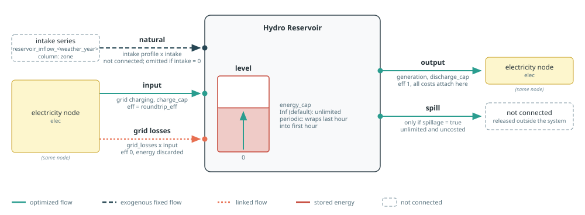
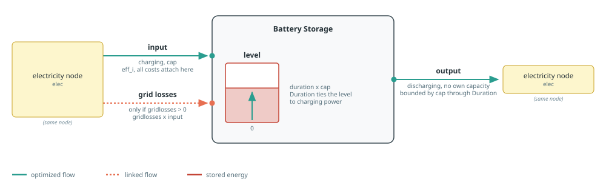

# Storage

Storage builders move electricity across time. Battery investment is attached
to charging power, while reservoir investment is attached to discharge power.
Hydrogen conversion and storage are documented on the
[Hydrogen](hydrogen.md) page.

See [Component Builders](../components.md) for shared naming, workbook,
capacity, and port conventions, and [Tags And
Post-Processing](../concepts/tags.md) for tagging and reporting.
Each section's diagram follows the conventions in [Reading The Port
Diagrams](../components.md#Reading-The-Port-Diagrams).

## Hydro Reservoir

[`makehydroreservoir`](@ref) creates a storage component with up to five flows:

- `natural` is unconnected fixed intake from the reservoir series;
- `input` is grid charging, always present and possibly at zero capacity;
- `output` is electricity generation;
- `spill` is optional unconnected release, enabled by `spillage`;
- `level` is stored energy.



In a `balance` query, `:input` selects all input-sense ports. Thus
`aggregate=true` sums the reservoir's `natural` and `input` flows, plus `grid
losses` when configured. To distinguish natural intake from grid charging, use
`aggregate=false` and read the `"natural"` or `"input"` entry.

The reservoir does not model endogenous capacity expansion, so it is the one
builder that departs from the [capacity contract](../components.md#Capacity-Semantics):
`discharge_cap`, `charge_cap`, and `energy_cap` accept only a number to fix the
capacity or an extracted snapshot to inherit it, and take no `mincap`/`maxcap`
bounds. Neither `nothing` nor a JuMP expression is accepted, because a
model-sized reservoir would be built free of charge: CAPEX and fixed O&M are
applied to discharging capacity alone. Costs still apply to the fixed
capacities, so an existing fleet reports its annualized cost. If you need an
expandable reservoir, write a dedicated component builder for it.

The grid-charging branch always exists: numeric zero charging gives it a zero
capacity, so a turbine-only reservoir still reports a charging flow of zero.
For the level, use `energy_cap=12_000.0` for a fixed 12 GWh reservoir, or omit
the keyword (equivalently, pass `Inf`) to leave the stored-energy level
unlimited by adding no level capacity behaviour.

Storage is periodic, so without a spill flow every unit of natural intake must
eventually be turbined. That can force uneconomic generation, or make the
reservoir infeasible when intake, turbine capacity, and level capacity do not
fit together. `spillage=true` adds an unlimited, uncosted `spill` output that
absorbs the excess. It is opt-in: the default `spillage=false` keeps the forced
use of all inflow. Spilled energy is reported by the hourly sheet's
`Total spillage` and `spillage <component>` columns.

The intake profile comes from sheet `reservoir_inflow_<weather_year>`, column `<zone>`.
When `intake_profile` is omitted and intake is enabled, `weather_year` must be
provided explicitly. It defaults to `nothing` and is unused with an explicit
profile or with `intake=0`. The profile is always normalized to sum to one,
then scaled by the requested total `intake`.

`roundtrip_eff` defaults to the row of the same name in the technology column named
by `tech_column` of sheet `storage`. It applies to grid charging; natural intake and discharge have unit
efficiency. `grid_losses` adds a proportional linked input flow. Cost defaults
come from the same technology column and are attached to discharge capacity.

Tags: `:tech => tech`, `:zone => elec.name`, and the function tags `generation`,
`storage`, and `carbonfree`.

See the [Hydro Reservoir example](../examples/hydro-reservoir.md) for a
turbine-only reservoir, and the [Pumped Storage
example](../examples/pumped-storage-hydro.md) for a reservoir with grid
charging.

```@docs; canonical=false
makehydroreservoir
```

## Batteries

[`makebatterystorage`](@ref) creates electricity storage with `input`, `output`, and
`level` ports. `power_cap` is the power capacity: a number fixes it, a JuMP
variable or affine expression reuses an external decision, `nothing` creates a
new decision, and an extracted snapshot fixes it to the matching component's
capacity. `power_mincap` and `power_maxcap` bound either variable form. The
`duration` behaviour applies `power_cap` to charging and to discharging alike,
and bounds the level at `power_cap * duration`.



`duration` links energy level to power capacity. It is structural: it comes
from the `storage` technology column in `:excel` mode and must be supplied in
`:arguments` mode. `roundtrip_eff` sets the storage input efficiency, and `simplified`
selects the corresponding Nosy storage formulation. In `:arguments` mode,
efficiency defaults to one and economic terms to zero; inactive capital and
decommissioning data are not resolved. Investment, connection, fixed O&M,
decommissioning, and variable O&M costs are attached to `input` capacity or
flow. `grid_losses` adds a linked charging loss.

Tags: `:tech => tech`, `:zone => elec.name`, and the function tags
`electricity`, `storage`, and `generation`. These tags make charging and
discharging enter the appropriate Posy2 reports.

See the [Battery Storage example](../examples/battery-storage.md) for a complete
model using this builder.

```@docs; canonical=false
makebatterystorage
```
