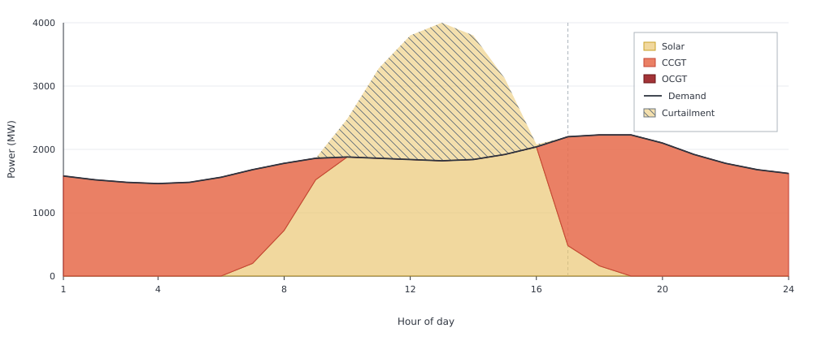
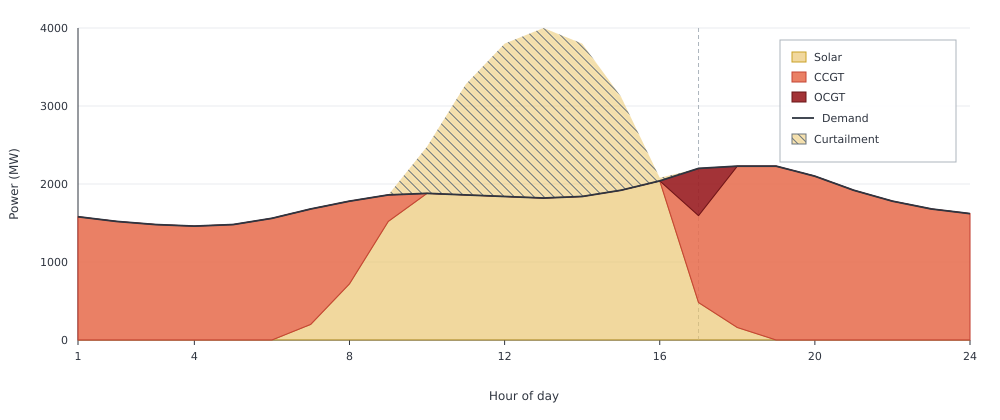

# Dispatch Optimization

Having enough generating capacity is not the same as having enough operational
flexibility.

In this example the CCGT fleet is large enough to meet the peak residual load
on its own. Yet a more expensive OCGT unit still runs in the evening. As solar
output falls while demand approaches its peak, residual load rises faster than
the CCGT fleet can ramp.

Capacities are fixed: 4000 MW of PV, a 2229 MW CCGT fleet (three 743 MW units),
and 1000 MW of OCGT, on an illustrative high-solar day repeated over the year.
All costs except fuel and variable O&M are zero. The electricity node uses
`rule=:curtailed`, so midday PV above demand can be spilled.

## Merit-order dispatch

First remove the ramp constraints. As expected from the merit order, the CCGT
follows the residual load and OCGT is never used.

```jldoctest dispatch_optimization; output = false
using Posy2
using Nosy
using HiGHS
import JuMP: set_silent

# Simulation and Posy2 input configuration
sim = Sim(Model(HiGHS.Optimizer); mesh=TimeMesh())
set_silent(model(sim))
snapshot = Snapshot(sim, Dict(:posy => Posy2Options(
    tech_mode=:arguments,
    timeseries_mode=:arguments,
)))

# Electricity node and CO2 sink
electricity = Node("country1", EnergyCarrier("electricity country1", sim), rule=:curtailed, tags=[:electricity])
co2 = Node("CO2", CO2Carrier("CO2", sim), rule=:curtailed, tags=[:co2])

# Evening peak demand and PV profile
day = [1580.0, 1520.0, 1480.0, 1460.0, 1480.0, 1560.0, 1680.0, 1780.0, 1860.0, 1880.0, 1860.0, 1840.0, 1820.0, 1840.0, 1920.0, 2040.0, 2200.0, 2229.0, 2229.0, 2100.0, 1920.0, 1780.0, 1680.0, 1620.0]
makedemand("Demand", "country1", electricity, snapshot; profile=repeat(day, 365))

# Fixed 4000 MW PV
pvday = [0.0, 0.0, 0.0, 0.0, 0.0, 0.0, 0.05, 0.18, 0.38, 0.62, 0.82, 0.95, 1.0, 0.95, 0.78, 0.52, 0.12, 0.04, 0.0, 0.0, 0.0, 0.0, 0.0, 0.0]
makeintermittentsource(
    "Solar", electricity, co2, snapshot; tech_column="PV",
    cap=4000.0,
    profile=repeat(pvday, 365),
)

# Cheap CCGT fleet, free to change output by any amount each hour
makedispatchable(
    "CCGT", electricity, co2, snapshot; tech_column="CCGT",
    cap=2229.0,
    fuel_cost=47.06,
    om_var_cost=6.99,
)

# More expensive OCGT unit
makedispatchable(
    "OCGT", electricity, co2, snapshot; tech_column="OCGT",
    cap=1000.0,
    fuel_cost=68.24,
    om_var_cost=10.47,
)

# Minimise total operating cost and extract solved values
optimize!(snapshot, cost(snapshot))
result = extract(snapshot)

# output

Snapshot with 4 component(s) and 1 node(s)

```

```jldoctest dispatch_optimization
julia> balance(result, "OCGT country1", :output, energy; collapse=true, aggregate=true)
0.0
```



CCGT follows the residual load through the evening. In hour 17 that residual is
1720 MW, and the fleet covers all of it. OCGT does not appear.

## Ramp-constrained dispatch

Costs and profiles are unchanged. The CCGT fleet now has `ramp_up=0.5` and
`ramp_down=0.5`. With three 743 MW units that is 1114.5 MW of additional or
reduced output per hour. OCGT keeps `ramp_up=1.0` and `ramp_down=1.0`, so it
can still move its full 1000 MW in one hour.

```jldoctest dispatch_optimization; output = false
using Posy2
using Nosy
using HiGHS
import JuMP: set_silent

# Simulation and Posy2 input configuration
sim = Sim(Model(HiGHS.Optimizer); mesh=TimeMesh())
set_silent(model(sim))
snapshot = Snapshot(sim, Dict(:posy => Posy2Options(
    tech_mode=:arguments,
    timeseries_mode=:arguments,
)))

# Same node and CO2 sink
electricity = Node("country1", EnergyCarrier("electricity country1", sim), rule=:curtailed, tags=[:electricity])
co2 = Node("CO2", CO2Carrier("CO2", sim), rule=:curtailed, tags=[:co2])

# Same evening peak day as above
day = [1580.0, 1520.0, 1480.0, 1460.0, 1480.0, 1560.0, 1680.0, 1780.0, 1860.0, 1880.0, 1860.0, 1840.0, 1820.0, 1840.0, 1920.0, 2040.0, 2200.0, 2229.0, 2229.0, 2100.0, 1920.0, 1780.0, 1680.0, 1620.0]
makedemand("Demand", "country1", electricity, snapshot; profile=repeat(day, 365))

# Same fixed PV
pvday = [0.0, 0.0, 0.0, 0.0, 0.0, 0.0, 0.05, 0.18, 0.38, 0.62, 0.82, 0.95, 1.0, 0.95, 0.78, 0.52, 0.12, 0.04, 0.0, 0.0, 0.0, 0.0, 0.0, 0.0]
makeintermittentsource(
    "Solar", electricity, co2, snapshot; tech_column="PV",
    cap=4000.0,
    profile=repeat(pvday, 365),
)

# Same CCGT fleet, limited to 1114.5 MW of additional or reduced output per hour
makedispatchable(
    "CCGT", electricity, co2, snapshot; tech_column="CCGT",
    cap=2229.0,
    fuel_cost=47.06,
    om_var_cost=6.99,
    unit_size=743.0,
    ramp_up=0.5,
    ramp_down=0.5,
)

# Same OCGT unit, able to cross its full range within one hour
makedispatchable(
    "OCGT", electricity, co2, snapshot; tech_column="OCGT",
    cap=1000.0,
    fuel_cost=68.24,
    om_var_cost=10.47,
    unit_size=500.0,
    ramp_up=1.0,
    ramp_down=1.0,
)

# Minimise total operating cost and extract solved values
optimize!(snapshot, cost(snapshot))
result_ramp = extract(snapshot)

# output

Snapshot with 4 component(s) and 1 node(s)

```

OCGT now runs in hour 17, as PV falls and demand approaches its evening peak:

```jldoctest dispatch_optimization
julia> balance(result_ramp, "OCGT country1", :output, energy; collapse=false, aggregate=true)
8760-element Nosy.Hourly{Float64}:
   0.0
   0.0
   0.0
   0.0
   0.0
   0.0
   0.0
   0.0
   0.0
   0.0
   ⋮
   0.0
 605.5
   0.0
   0.0
   0.0
   0.0
   0.0
   0.0
   0.0
```



In hour 16 residual load is still zero: PV covers demand and the CCGT is off.
In hour 17 residual load is 1720 MW. From 0 MW the fleet can reach at most
1114.5 MW and OCGT supplies the remaining 605.5 MW.

OCGT is not covering a shortage of installed capacity. The CCGT fleet has
2229 MW, enough for the evening peak two hours later, and it does reach that
peak. OCGT runs in hour 17 because the fleet cannot ramp up from 0 MW in hour 16
to the 1720 MW residual in one hour.

### Summary

Total operating cost rises because the OCGT unit is more expensive than the
capacity it replaces:

```jldoctest dispatch_optimization
julia> cost(result)
5.342015535000107e8

julia> cost(result_ramp)
5.396515984500146e8

julia> balance(result_ramp, "OCGT country1", :output, energy; collapse=true, aggregate=true)
221007.5
```

| | Merit order | Ramp-constrained |
|:---|---:|---:|
| Annual OCGT generation (MWh) | 0 | 221007.5 |
| Peak OCGT output (MW) | 0 | 605.5 |
| Total operating cost (currency/year) | 5.342e8 | 5.397e8 |
| Hours when OCGT runs | never | 17 |

Enough capacity does not mean enough flexibility. The cheapest generator is
not always physically available when it is needed.
