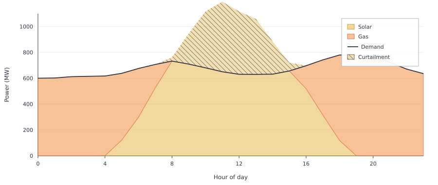

# Dispatchable Generation

Variable PV leaves nights and low-irradiance hours short of solar.
[`makedispatchable`](@ref) adds a gas plant on the same electricity node
for that residual. Both PV and gas capacities are chosen in the cost
minimisation.

```jldoctest dispatchable_generation; output = false
using Posy2
using Nosy
using HiGHS
import JuMP: set_silent

# Simulation and Posy2 input configuration
sim = Sim(Model(HiGHS.Optimizer); mesh=TimeMesh())
set_silent(model(sim))
example_data_dir = joinpath(pkgdir(Posy2), "data")
snapshot = Snapshot(sim, Dict(:posy => Posy2Options(
    data_dir=example_data_dir,
    techdata_file="tech_data.xlsx",
    timeseries_file="time_series.xlsx",
    tech_mode=:arguments,
    timeseries_mode=:excel,
)))

# Electricity node and CO2 sink
electricity = Node("country1", EnergyCarrier("electricity country1", sim), rule=:curtailed, tags=[:electricity])
co2 = Node("CO2", CO2Carrier("CO2", sim), rule=:curtailed, tags=[:co2])

# Hourly electricity demand from the time-series workbook
makedemand("Demand", "country1", electricity, snapshot)

# Optimised PV capacity
makeintermittentsource(
    "Solar", electricity, co2, snapshot; tech_column="PV",
    maxcap=5_000.0,
    weather_year=2019,
    overnight_cost=500.0,
    lifetime=25,
    construction_profile=1.0,
)

# Optimised gas capacity for the residual load
makedispatchable(
    "Gas", electricity, co2, snapshot; tech_column="CCGT",
    maxcap=2_000.0,
    overnight_cost=955.0,
    lifetime=30,
    construction_profile=1.0,
    fuel_cost=47.06,
)

# Minimise total system cost and extract solved values
optimize!(snapshot, cost(snapshot))
result = extract(snapshot)

# output

Snapshot with 3 component(s) and 1 node(s)

```

The optimiser installs about 1.37 GW of PV and about 1.03 GW of gas. Gas
capacity matches peak residual demand, here equal to peak demand when PV is
zero, so nights and low-PV hours can still be filled after PV is built.

```jldoctest dispatchable_generation
julia> table(result, capacity)
1×3 DataFrame
 Row │ Demand country1  Gas country1  Solar country1
     │ Float64          Float64       Float64
─────┼───────────────────────────────────────────────
   1 │             0.0       1030.76         1370.55
```

Those capacities show up in the hourly dispatch. Over one day, solar (bottom)
and gas (top) stack to the demand line: gas shrinks when PV is strong and
fills the residual when it is not. Surplus PV above demand is curtailed
(`rule=:curtailed`).


