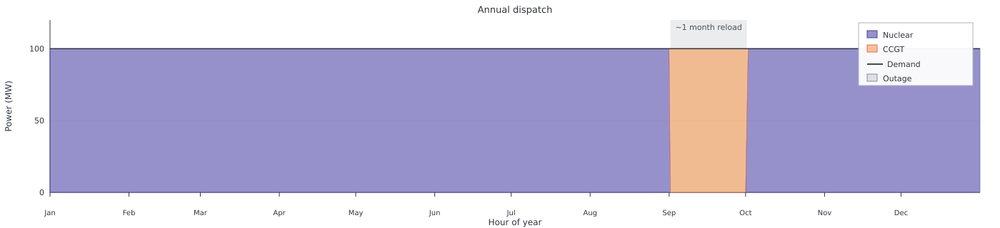
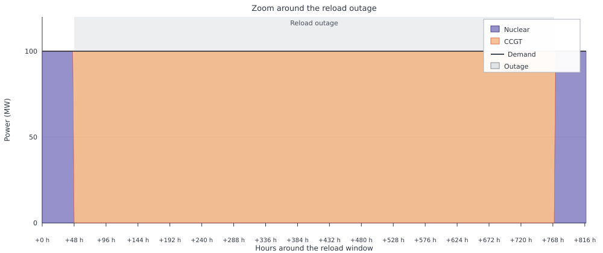

# Dispatchable Generation

This page combines [`makenuclear`](@ref) and [`makedispatchable`](@ref) in one
system to show why nuclear fuel reloading matters for system planning. Unlike
gas-fired plants, nuclear units need periodic **refuelling** outages (and the
maintenance that usually accompanies them). Those outages last many consecutive
hours—often weeks in reality—so the system needs enough dispatchable backup to
keep supply while the reactor is offline. This example shows why that backup
capacity matters.

Other technologies also have planned outages, but usually for different reasons.
Coal and CCGT plants schedule maintenance; they do not stop for weeks because
they need to reload fuel—gas and coal are supplied continuously while the plant
runs. Wind, solar, and hydro have no refuelling concept at all. POSY2 therefore
gives nuclear dedicated reload parameters that model this **refuelling
outage**, rather than a generic maintenance switch shared by every generator.

In POSY2 the outage is mandatory, not an economic choice. The optimiser may
pick when to reload (subject to `reloadmask`), but not whether to
reload or how long the required downtime lasts: `reload_fraction_per_year`
and `reload_duration` fix the obligation. What this example highlights is that
scheduling decision when the long zero-output window falls and the backup
capacity needed to cover it.

Flat 100 MW demand keeps the numbers readable. Both plants use `maxcap` rather
than a fixed `cap`, so the optimiser also chooses how much capacity to build.
Technology costs come from `tech_data.xlsx` (`tech_mode=:excel`). Reloading is
not active in that workbook by default, so the nuclear plant sets `uc=true`
with explicit `reload_fraction_per_year`, `reload_duration`, and `reloadmask`.
Reloading needs a full-year mesh. `integeruc=true` keeps commitment on/off so
the outage stays sharp.

```jldoctest dispatchable_generation; output = false
using POSY2
using Nosy
using HiGHS
import JuMP: set_silent

sim = Sim(Model(HiGHS.Optimizer); mesh=TimeMesh())
set_silent(model(sim))
example_data_dir = joinpath(pkgdir(POSY2), "data")
snapshot = Snapshot(sim, Dict(:posy => POSY2Options(
    data_dir=example_data_dir,
    techdata_file="tech_data.xlsx",
    timeseries_file="unused.xlsx",
    tech_mode=:excel,
    timeseries_mode=:arguments,
    discountrate=0.05,
)))

electricity = Node("COUNTRY", EnergyCarrier("electricity COUNTRY", sim), rule=:curtailed, tags=[:electricity])
co2 = Node("CO2", CO2Carrier("CO2", sim), rule=:curtailed, tags=[:co2])

makedemand("Demand", "COUNTRY", electricity, snapshot; coeff=0.0, yearlyconstant=100.0 * 8760)

makenuclear(
    "Nuclear", "Nuclear", electricity, co2, snapshot;
    maxcap=200.0,
    unit_size=100.0,
    uc=true,
    integeruc=true,
    reload_fraction_per_year=1.0,  # ≥1 reload per unit per year
    reload_duration=720.0,         # each reload lasts 720 h (~30 days)
    reloadmask=2920,               # reload may start only every 2920 h
    min_power=0.5,
    min_uptime=24.0,
    min_downtime=24.0,
    startup_duration=1.0,
    shutdown_duration=1.0,
    no_load_cost=0.0,
    startup_cost=0.0,
)

makedispatchable(
    "CCGT", "CCGT", electricity, co2, snapshot;
    maxcap=200.0,
    unit_size=0.0,
)

optimize!(snapshot, cost(snapshot))
result = extract(snapshot)

# output

Snapshot with 3 component(s) and 2 node(s)
    
```

The build-out is 100 MW nuclear plus 100 MW CCGT. Nuclear is cheaper for most
of the year, but the required reload outage forces a second plant that can
cover the full 100 MW demand while nuclear is offline:

```jldoctest dispatchable_generation
julia> table(result, capacity)
1×3 DataFrame
 Row │ CCGT COUNTRY  Demand COUNTRY  Nuclear COUNTRY
     │ Float64       Float64         Float64
─────┼───────────────────────────────────────────────
   1 │        100.0             0.0            100.0
```

`reload_duration=720` is the fixed planned downtime (about 30 days)—the
optimiser cannot shorten it. `reloadmask` only restricts **which hours** may
start a reload; among those candidates the model chooses the timing that fits
the year best. The annual picture makes the disruption clear: nuclear runs near
100 MW for most of the 8760 hours, then drops for a contiguous block of about a
month while the CCGT takes the flat demand.



Zooming on the same outage shows the hand-off at each end: a one-hour 50 MW
ramp (`min_power=0.5`) between nuclear and the CCGT.



`findfirst(iszero, nuclear)` and `findlast(iszero, nuclear)` locate that
window. The zero-output interval is a little longer than `reload_duration`
alone because unit-commitment shutdown, minimum-downtime, and startup
conditions sit around the reload block:

```jldoctest dispatchable_generation
julia> nuclear = balance(result, "Nuclear COUNTRY", :output, energy; collapse=false, aggregate=true);

julia> ccgt = balance(result, "CCGT COUNTRY", :output, energy; collapse=false, aggregate=true);

julia> i0, i1 = findfirst(iszero, nuclear), findlast(iszero, nuclear)
(5842, 6564)

julia> nuclear[i0-2:i0+1]
4-element Vector{Float64}:
 100.0
  50.0
   0.0
   0.0

julia> ccgt[i0-2:i0+1]
4-element Vector{Float64}:
   0.0
  50.0
 100.0
 100.0

julia> nuclear[i1-1:i1+2]
4-element Vector{Float64}:
   0.0
   0.0
  50.0
 100.0

julia> ccgt[i1-1:i1+2]
4-element Vector{Float64}:
 100.0
 100.0
  50.0
   0.0

julia> count(iszero, nuclear)
723
```

Without the CCGT capacity the system could not meet demand through that
outage. Workbook-derived fixed costs (annualised) scale with the chosen
capacities; investment and decommissioning are the columns that matter here:

```jldoctest dispatchable_generation
julia> costs(result)[:, [:component, :investment, :decommissioning]]
4×3 DataFrame
 Row │ component        investment  decommissioning
     │ String           Float64     Float64
─────┼──────────────────────────────────────────────
   1 │ CCGT COUNTRY      6.52821e6    66818.5
   2 │ Demand COUNTRY    0.0              0.0
   3 │ Nuclear COUNTRY   2.07056e7        1.10394e5
   4 │ all               2.72338e7   177212.0
```
