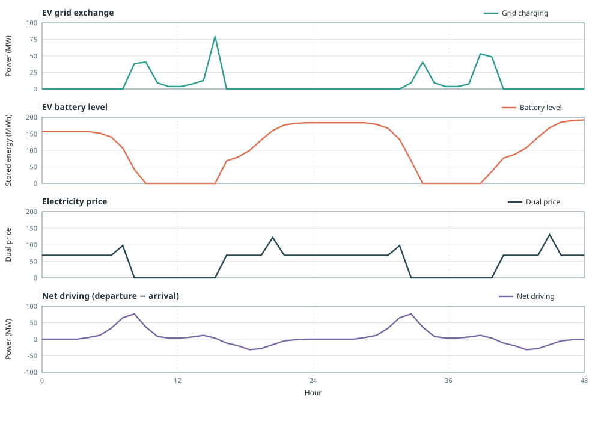
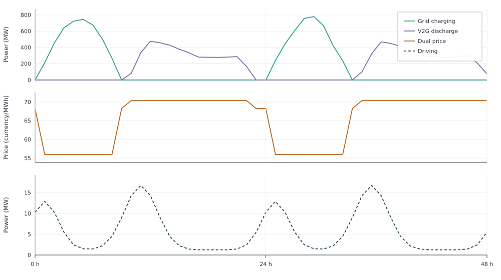

# Electric Vehicles

[`makeEV`](@ref) can run as a fixed charging shape, smart charging, or
vehicle-to-grid. Exactly one of `fixed_profile`, `smart_charging`, and
`vehicle_to_grid` must be `true`. This page shows the two flexible modes side by
side.

In both modes the workbook `EV_driving_profile` is a **fixed** hourly draw: the
optimiser does not reshape driving. What changes is the grid side. Smart
charging only chooses when to fill the battery. V2G also chooses when to inject
power back into the electricity node. In the solved system, charging aligns with
lower-price hours and discharge with higher-price hours.

Workbook demand and PV for `country1` set the timing (`timeseries_mode=:excel`).
Oil and the EV fleet stay as argument-mode teaching values. Charging
availability also comes from the workbook via `zone="country1"`. Workbook-scale
assumptions (about 10 kW charge power, 60 kWh battery, 90% efficiency) stay as
teaching values. The `yearly` argument is the fleet's annual driving energy.

## Smart charging

With `smart_charging=true`, charge hours are free but energy leaves the fleet
only as driving. The EV `:output` port is that fixed workbook profile on an
unconnected carrier, not an injection into the electricity node. Stored `level`
links charge and driving.

```jldoctest electric_vehicles_smart; output = false
using POSY2
using Nosy
using HiGHS
import JuMP: set_silent

sim = Sim(Model(HiGHS.Optimizer); mesh=TimeMesh())
set_silent(model(sim))
example_data_dir = joinpath(pkgdir(POSY2), "data")
snapshot = Snapshot(sim, Dict(:posy => POSY2Options(
    data_dir=example_data_dir,
    techdata_file="tech_data.xlsx",
    timeseries_file="time_series.xlsx",
    tech_mode=:arguments,
    timeseries_mode=:excel,
)))

electricity = Node("country1", EnergyCarrier("electricity country1", sim), rule=:curtailed, tags=[:electricity])
co2 = Node("CO2", CO2Carrier("CO2", sim), rule=:curtailed, tags=[:co2])

makedemand("Demand", "country1", electricity, snapshot)

makeintermittentsource(
    "Solar", "PV", electricity, co2, snapshot;
    cap=1500.0,
    weatheryear=2019,
    overnight_cost=0.0,
    om_fixed_cost=0.0,
    decommissioning=0.0,
    lifetime=25,
    construction_profile=1.0,
    decommissioning_profile=1.0,
    connection_cost=0.0,
    om_var_cost=0.0,
    fuel_cost=0.0,
    co2_emission=0.0,
)

makeEV(
    "EV", 50000.0, electricity, snapshot;
    fixed_profile=false,
    smart_charging=true,
    zone="country1",
    charging_eff=0.9,
    self_discharge=0.0,
    min_level_morning=0.0,
    max_charging_power_per_ev=0.01,
    max_dispatch_power_per_ev=0.0,
    battery_capacity_per_ev=0.06,
    yearly_consumption_per_ev=0.02,
)

makedispatchable(
    "Oil", "Oil", electricity, co2, snapshot;
    cap=1200.0,
    overnight_cost=0.0,
    om_fixed_cost=0.0,
    decommissioning=0.0,
    lifetime=30,
    construction_profile=1.0,
    decommissioning_profile=1.0,
    connection_cost=0.0,
    om_var_cost=0.0,
    fuel_cost=68.24,
    co2_emission=0.0,
    unit_size=0.0,
)

optimize!(snapshot, cost(snapshot))
result = extract(snapshot)

# output

Snapshot with 4 component(s) and 1 node(s)

```

The only `:output` key is `driving`. Annual driving equals `yearly`. In
smart-charging mode, only the fixed driving output is active. Since the V2G
output is disabled, `charging_eff` does not affect the annual charge–drive
balance, so `sum(charge)` equals `sum(driving)`. `level` stores the shift from
cheap solar hours into later driving:

```jldoctest electric_vehicles_smart
julia> charge = balance(result, "EV country1", :input, energy; collapse=false, aggregate=true);

julia> driving = balance(result, "EV country1", :output, energy; collapse=false, aggregate=true);

julia> sort(collect(keys(balance(result, "EV country1", :output, energy; collapse=false, aggregate=false))))
1-element Vector{String}:
 "driving"

julia> sum(driving)
50000.000000000015

julia> sum(charge)
50000.00000000007

julia> maximum(charge)
459.6835

julia> balance(result, "Oil country1", :output, energy; collapse=true, aggregate=true)
4.674084344000011e6
```

Oil still covers residual demand on the node; the cars never export power.



## Vehicle-to-grid

The same system with `vehicle_to_grid=true` keeps the **same fixed driving
profile**, and adds a second `:output` port that injects into the electricity
node. Discharge is capped by `max_dispatch_power_per_ev` and costs
`compensation` (USD/MWh). That fee discourages free cycling; discharge remains
worthwhile when it displaces oil generation. The node uses `evalprice=true` so
Nosy's `dualprice` can be plotted beside the flows: in the solution, charging
lines up with lower duals and V2G discharge with higher ones.

```jldoctest electric_vehicles_v2g; output = false
using POSY2
using Nosy
using HiGHS
import JuMP: set_silent

sim = Sim(Model(HiGHS.Optimizer); mesh=TimeMesh())
set_silent(model(sim))
example_data_dir = joinpath(pkgdir(POSY2), "data")
snapshot = Snapshot(sim, Dict(:posy => POSY2Options(
    data_dir=example_data_dir,
    techdata_file="tech_data.xlsx",
    timeseries_file="time_series.xlsx",
    tech_mode=:arguments,
    timeseries_mode=:excel,
)))

electricity = Node(
    "country1",
    EnergyCarrier("electricity country1", sim),
    rule=:curtailed,
    evalprice=true,
    tags=[:electricity],
)
co2 = Node("CO2", CO2Carrier("CO2", sim), rule=:curtailed, tags=[:co2])

makedemand("Demand", "country1", electricity, snapshot)

makeintermittentsource(
    "Solar", "PV", electricity, co2, snapshot;
    cap=1500.0,
    weatheryear=2019,
    overnight_cost=0.0,
    om_fixed_cost=0.0,
    decommissioning=0.0,
    lifetime=25,
    construction_profile=1.0,
    decommissioning_profile=1.0,
    connection_cost=0.0,
    om_var_cost=0.0,
    fuel_cost=0.0,
    co2_emission=0.0,
)

makeEV(
    "EV", 50000.0, electricity, snapshot;
    fixed_profile=false,
    smart_charging=false,
    vehicle_to_grid=true,
    zone="country1",
    charging_eff=0.9,
    self_discharge=0.0,
    min_level_morning=0.0,
    max_charging_power_per_ev=0.01,
    max_dispatch_power_per_ev=0.01,
    battery_capacity_per_ev=0.06,
    yearly_consumption_per_ev=0.02,
    compensation=20.0,
)

makedispatchable(
    "Oil", "Oil", electricity, co2, snapshot;
    cap=1200.0,
    overnight_cost=0.0,
    om_fixed_cost=0.0,
    decommissioning=0.0,
    lifetime=30,
    construction_profile=1.0,
    decommissioning_profile=1.0,
    connection_cost=0.0,
    om_var_cost=0.0,
    fuel_cost=68.24,
    co2_emission=0.0,
    unit_size=0.0,
)

optimize!(snapshot, cost(snapshot))
result = extract(snapshot)

# output

Snapshot with 4 component(s) and 1 node(s)

```

Driving is still the fixed workbook profile: the fleet keeps the same annual
driving draw. The new `output` key is grid injection on top of that, so cars
still drive while the battery also supports the node. The dual price on this
toy system takes two values: a lower level when surplus solar sets the margin,
and `68.24` when oil does:

```jldoctest electric_vehicles_v2g
julia> charge = balance(result, "EV country1", :input, energy; collapse=false, aggregate=true);

julia> outputs = balance(result, "EV country1", :output, energy; collapse=false, aggregate=false);

julia> driving = outputs["driving"];

julia> grid = outputs["output"];

julia> price = dualprice(result.nodes["country1"]);

julia> sort(collect(keys(outputs)))
2-element Vector{String}:
 "driving"
 "output"

julia> sum(driving)
50000.000000000015

julia> sum(grid)
260529.24333333326

julia> sum(charge)
284476.319

julia> round.(extrema(price); digits=2)
(53.6, 68.24)

julia> balance(result, "Oil country1", :output, energy; collapse=true, aggregate=true)
4.413555100666671e6
```

In the figure, charging lines up with the lower dual and V2G discharge with the
oil-priced hours, while driving keeps its own fixed shape.



### Comparing the two modes

Same demand, solar, and fixed driving need; only the EV grid mode changes.
Smart charging has no grid discharge port. V2G adds one, so annual oil falls
while driving energy stays the same.

| | Smart | V2G |
|:---|---:|---:|
| `:output` ports | `driving` only | `driving` + `output` |
| Grid discharge (MWh/year) | 0 | 260529 |
| Oil generation (MWh/year) | 4.674e6 | 4.414e6 |
| Driving energy (MWh/year) | 50000 | 50000 |

Fixed-profile mode reuses the same [`makeEV`](@ref) builder with
`fixed_profile=true` and the off-hour arguments; it is not repeated here.
