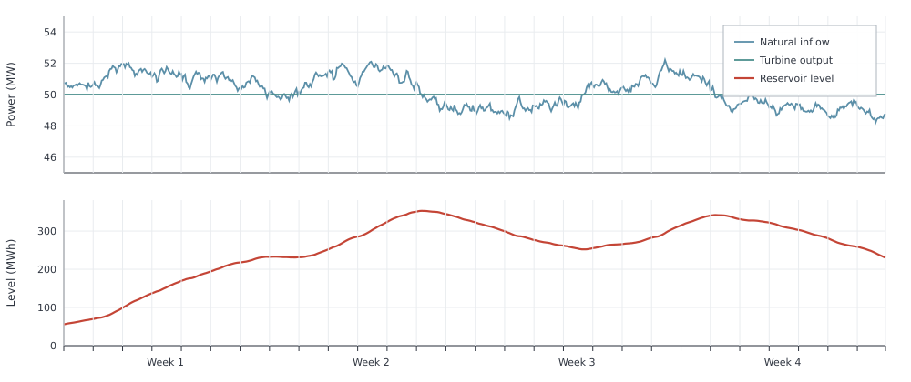

# Hydro Reservoir

This example shows how a hydro reservoir shifts natural intake across time.
With flat demand, reservoir level changes come from variable intake. A reservoir
[`makehydroreservoir`](@ref) stores water when it arrives and releases it
later on the same electricity node. The default `TimeMesh()` is circular, so
the reservoir level wraps from the last hour into the first. Year-end and
year-start are continuous.

```jldoctest hydro_reservoir; output = false
using Posy2
using Nosy
using HiGHS
import JuMP: set_silent

# Simulation and Posy2 input configuration
sim = Sim(Model(HiGHS.Optimizer); mesh=TimeMesh())
set_silent(model(sim))
example_data_dir = joinpath(pkgdir(Posy2), "data")
snapshot = Snapshot(
    sim,
    Dict(:posy => Posy2Options(
        data_dir=example_data_dir,
        techdata_file="tech_data.xlsx",
        timeseries_file="time_series.xlsx",
        tech_mode=:excel,
        timeseries_mode=:excel,
    )),
)

# Electricity node and CO2 sink
electricity = Node("country1", EnergyCarrier("electricity country1", sim), rule=:curtailed, tags=[:electricity])
co2 = Node("CO2", CO2Carrier("CO2", sim), rule=:curtailed, tags=[:co2])

# Flat 50 MW demand so level changes come from the intake shape alone
makedemand("Demand", "country1", electricity, snapshot; coeff=0.0, yearlyconstant=50.0 * 8760)

# Fixed reservoir: 100 MW turbine, no grid pumping, 40 MW average intake
makehydroreservoir(
    "Reservoir hydro",
    "Hydro res",
    "country1",
    electricity,
    snapshot;
    cap_discharging=100.0,      # turbine capacity (MW)
    cap_charging=0.0,           # no pumping from the electricity grid
    intake=40.0 * 8760,         # annual natural intake (MWh)
    cap_reservoir=40.0 * 8760, # fixed reservoir energy capacity (MWh)
    weatheryear=2019,
    simplified=true,
)

# Fixed 100 MW CCGT backup when hydro cannot cover demand
makedispatchable("CCGT", "CCGT", electricity, co2, snapshot; cap=100.0, unit_size=0.0)

# Minimise total system cost and extract solved values
optimize!(snapshot, cost(snapshot))
result = extract(snapshot)

# output

Snapshot with 3 component(s) and 2 node(s)

```

Over the year, total natural intake equals total turbine generation. The reservoir does not
change how much water is used. It changes when that water is released.

```jldoctest hydro_reservoir
julia> balance(result, "Reservoir hydro country1", :input, energy; collapse=true, aggregate=true)
350399.9999999993

julia> balance(result, "Reservoir hydro country1", :output, energy; collapse=true, aggregate=true)
350399.9999999997
```

In the figure, intake and turbine output follow different paths. When intake is above
the turbine the reservoir level rises. When intake is below it the reservoir level falls.
Over these four weeks the level rises, then falls:



The reservoir therefore decouples water arrival from electricity generation.
Natural intake follows its weather-driven profile, while stored water can be
released at a different time to serve the electricity node.
