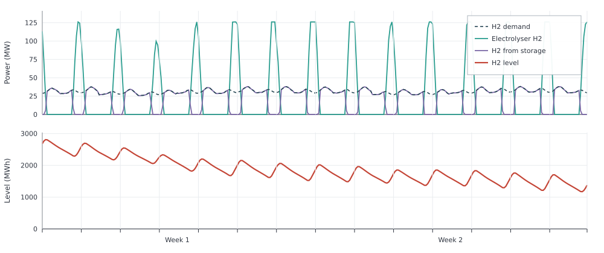

# Hydrogen Production

This example shows how hydrogen storage shifts supply from PV powered
electrolysis to meet hydrogen demand at other hours.

Hydrogen demand varies through the year and averages about 28 MW. An
electrolyser can make that hydrogen only when PV electricity is available, so
production and demand do not line up hour by hour. The electrolyser converts
electricity to hydrogen. Storage on the hydrogen node holds daytime surplus
and releases it later. Flexibility sits on the hydrogen side.

The setup is:

- hydrogen demand averaging about 28 MW
- expandable PV and electrolyser
- fixed hydrogen storage of about one week of that mean load

```jldoctest hydrogen_production; output = false
using Posy2
using Nosy
using HiGHS
import JuMP: set_silent

# Simulation and Posy2 input configuration
sim = Sim(Model(HiGHS.Optimizer); mesh=TimeMesh())
set_silent(model(sim))
example_data_dir = joinpath(pkgdir(Posy2), "data")
snapshot = Snapshot(sim, Dict(:posy => Posy2Options(
    data_dir=example_data_dir,
    techdata_file="tech_data.xlsx",
    timeseries_file="time_series.xlsx",
    tech_mode=:excel,
    timeseries_mode=:excel,
)))

# Electricity node, hydrogen node, and CO2 sink
electricity = Node("country1", EnergyCarrier("electricity country1", sim), rule=:curtailed, tags=[:electricity])
hydrogen = Node("H2 country1", EnergyCarrier("hydrogen country1", sim), rule=:default, tags=[:hydrogen])
co2 = Node("CO2", CO2Carrier("CO2", sim), rule=:curtailed, tags=[:co2])

# Shaped hydrogen demand, about 28 MW on average
makedemand("Hydrogen demand", "country1", hydrogen, snapshot; profile_multiplier=0.038)

# Expandable PV and electrolyser (workbook tech costs)
makeintermittentsource("Solar", electricity, co2, snapshot; tech_column="PV", maxcap=1000.0, weather_year=2019)
makeelectrolyser("Electrolyser", electricity, hydrogen, snapshot; tech_column="PEM", maxcap=300.0)

# Fixed hydrogen storage
makehydrogenstorage(
    "H2 storage", hydrogen, snapshot; tech_column="Hydrogen storage",
    energy_cap=28.0 * 168,   # about one week of the mean hydrogen demand
)

# Minimise total system cost and extract solved values
optimize!(snapshot, cost(snapshot))
result = extract(snapshot)

# output

Snapshot with 4 component(s) and 2 node(s)

```

With storage capacity fixed at about one week of hydrogen, the model sizes PV and
the electrolyser to meet demand at least cost:

```jldoctest hydrogen_production
julia> table(result, capacity)[:, ["Electrolyser country1", "H2 storage H2 country1", "Solar country1"]]
1×3 DataFrame
 Row │ Electrolyser country1  H2 storage H2 country1  Solar country1
     │ Float64                Float64                 Float64
─────┼───────────────────────────────────────────────────────────────
   1 │               216.453                  4704.0         753.822
```

The figure shows two timescales. Within each day, electrolyser output rises
above demand in sunny hours and the surplus fills storage, so the level rises.
When production falls short, storage covers the remaining demand and the level
falls. These two weeks are weaker on PV than much of the year, so hydrogen
production stays below demand overall. The level trends down even while the
day–night cycle repeats:


