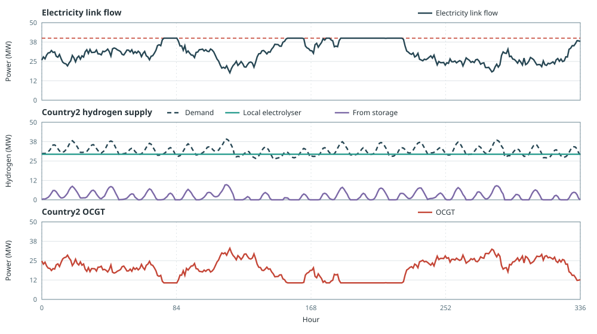
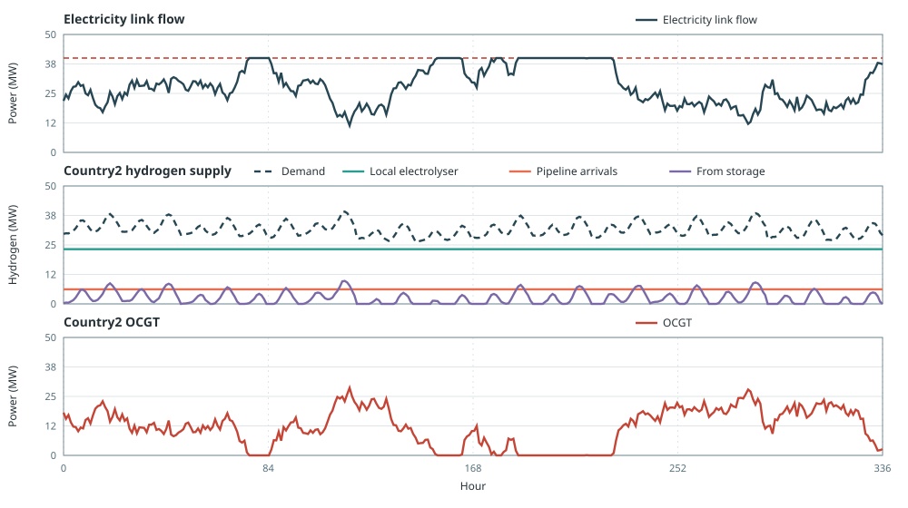

# Hydrogen Transport

This example compares a 40 MW electricity link with and without a
[`makehydrogentransport`](@ref) corridor.

The setup is:

- country1: expandable onshore wind and an electrolyser
- country2: hydrogen demand averaging about 28 MW, a local electrolyser, OCGT,
  and one week of hydrogen storage
- a 40 MW electricity link between the two countries

Without the corridor, country2 must make all of the hydrogen. Because
electrolyser efficiency is less than one, electricity input exceeds hydrogen
output, so the 40 MW link cannot cover high demand hours and OCGT fills the
gap. With the corridor, some hydrogen can be made next to the wind and moved
to country2. OCGT generation and total cost fall in this case.

## Electricity link only

```jldoctest hydrogen_transport; output = false
using Posy2
using Nosy
using HiGHS
import JuMP: set_silent

# Simulation and Posy2 input configuration
sim = Sim(Model(HiGHS.Optimizer); mesh=TimeMesh())
set_silent(model(sim))
example_data_dir = joinpath(pkgdir(Posy2), "data")
snapshot = Snapshot(sim, Dict(:posy => Posy2Options(
    data_dir=example_data_dir,
    techdata_file="tech_data.xlsx",
    timeseries_file="time_series.xlsx",
    tech_mode=:excel,
    timeseries_mode=:excel,
)))

# Electricity nodes, hydrogen nodes, and CO2 sink
elec_a = Node("country1", EnergyCarrier("electricity country1", sim), rule=:curtailed, tags=[:electricity])
elec_b = Node("country2", EnergyCarrier("electricity country2", sim), rule=:curtailed, tags=[:electricity])
h2_a = Node("H2A", EnergyCarrier("hydrogen A", sim), rule=:default, tags=[:hydrogen])
h2_b = Node("H2B", EnergyCarrier("hydrogen B", sim), rule=:default, tags=[:hydrogen])
co2 = Node("CO2", CO2Carrier("CO2", sim), rule=:curtailed, tags=[:co2])

# Industrial hydrogen demand on country2, about 28 MW on average
makedemand("Hydrogen demand", "country1", h2_b, snapshot; profile_multiplier=0.038)

# Expandable wind and electrolysers (workbook tech costs)
makeintermittentsource("Wind", elec_a, snapshot; co2_node=co2, tech_column="Onwind", maxcap=2000.0, weather_year=2019)
makeelectrolyser("Electrolyser A", elec_a, h2_a, snapshot; tech_column="PEM", maxcap=400.0)
makeelectrolyser("Electrolyser B", elec_b, h2_b, snapshot; tech_column="PEM", maxcap=400.0)

# Fixed hydrogen storage on the demand side
makehydrogenstorage(
    "H2 storage", h2_b, snapshot; tech_column="Hydrogen storage",
    energy_cap=28.0 * 168,
)

# Country2 backup for hours when the electricity link cannot feed the electrolyser
makedispatchable("OCGT", elec_b, snapshot; co2_node=co2, tech_column="OCGT", cap=800.0)

# Binding 40 MW electricity corridor
maketransmissionlink(
    "IC", elec_a, elec_b, snapshot;
    cap=40.0,
    a_to_b_availability=1.0,
    b_to_a_availability=1.0,
)

# Minimise total system cost and extract solved values
optimize!(snapshot, cost(snapshot))
result = extract(snapshot)

# output

Snapshot with 7 component(s) and 5 node(s)

```

All hydrogen is made at country2. The country1 electrolyser stays at zero
because there is no way to deliver that hydrogen. The electricity link supplies
part of the electricity used by the country2 electrolyser. OCGT covers the rest:

```jldoctest hydrogen_transport
julia> balance(result, "Hydrogen demand H2B", :input, energy; collapse=true, aggregate=true)
244701.17259600075

julia> capacity(result, "Electrolyser A country1")
0.0

julia> capacity(result, "Electrolyser B country2")
50.659632743304044

julia> balance(result, "OCGT country2", :output, energy; collapse=true, aggregate=true)
182127.49113264642
```

The link cannot cover all of that electrolyser electricity, so OCGT runs
for 182 GWh over the year.

The top panel shows when the electricity link reaches its 40 MW limit. The
middle panel shows local electrolysis and storage meeting hydrogen demand. The
bottom panel shows OCGT when imported electricity is not enough.



## Electricity link and hydrogen corridor

The second run lets country1 send hydrogen to country2. The corridor is
expandable, with 5 % send-side loss, compressor electricity on country1, and
an overnight cost of 400 currency/kW.

```jldoctest hydrogen_transport; output = false
using Posy2
using Nosy
using HiGHS
import JuMP: set_silent

# Simulation and Posy2 input configuration
sim = Sim(Model(HiGHS.Optimizer); mesh=TimeMesh())
set_silent(model(sim))
example_data_dir = joinpath(pkgdir(Posy2), "data")
snapshot = Snapshot(sim, Dict(:posy => Posy2Options(
    data_dir=example_data_dir,
    techdata_file="tech_data.xlsx",
    timeseries_file="time_series.xlsx",
    tech_mode=:excel,
    timeseries_mode=:excel,
)))

# Electricity nodes, hydrogen nodes, and CO2 sink
elec_a = Node("country1", EnergyCarrier("electricity country1", sim), rule=:curtailed, tags=[:electricity])
elec_b = Node("country2", EnergyCarrier("electricity country2", sim), rule=:curtailed, tags=[:electricity])
h2_a = Node("H2A", EnergyCarrier("hydrogen A", sim), rule=:default, tags=[:hydrogen])
h2_b = Node("H2B", EnergyCarrier("hydrogen B", sim), rule=:default, tags=[:hydrogen])
co2 = Node("CO2", CO2Carrier("CO2", sim), rule=:curtailed, tags=[:co2])

# Same demand, wind, electrolysers, storage, OCGT, and electricity link
makedemand("Hydrogen demand", "country1", h2_b, snapshot; profile_multiplier=0.038)
makeintermittentsource("Wind", elec_a, snapshot; co2_node=co2, tech_column="Onwind", maxcap=2000.0, weather_year=2019)
makeelectrolyser("Electrolyser A", elec_a, h2_a, snapshot; tech_column="PEM", maxcap=400.0)
makeelectrolyser("Electrolyser B", elec_b, h2_b, snapshot; tech_column="PEM", maxcap=400.0)
makehydrogenstorage(
    "H2 storage", h2_b, snapshot; tech_column="Hydrogen storage",
    energy_cap=28.0 * 168,
)
makedispatchable("OCGT", elec_b, snapshot; co2_node=co2, tech_column="OCGT", cap=800.0)
maketransmissionlink(
    "IC", elec_a, elec_b, snapshot;
    cap=40.0,
    a_to_b_availability=1.0,
    b_to_a_availability=1.0,
)

# Expandable hydrogen corridor: loss, compressor electricity, and CAPEX
makehydrogentransport(
    "H2 pipeline", h2_a, h2_b, snapshot;
    maxcap=400.0,
    loss_factor=0.05,
    electricity_coeff=0.02,
    elec_a=elec_a,
    overnight_cost=400.0,
    om_fixed_cost=8.0,
    lifetime=40,
    construction_profile=1.0,
)

# Minimise total system cost and extract solved values
optimize!(snapshot, cost(snapshot))
result_h2 = extract(snapshot)

# output

Snapshot with 8 component(s) and 5 node(s)

```

The optimiser builds a small hydrogen corridor and some electrolysis in
country1. As a result, less hydrogen must be produced locally in country2, and
the optimal country2 electrolyser capacity falls to 40 MW. Pipeline arrivals,
local production, and storage still meet demand:

```jldoctest hydrogen_transport
julia> capacity(result_h2, "H2 pipeline_H2A_H2B")
6.507986306438662

julia> capacity(result_h2, "Electrolyser A country1")
11.220666045583895

julia> capacity(result_h2, "Electrolyser B country2")
40.0

julia> balance(result_h2, "OCGT country2", :output, energy; collapse=true, aggregate=true)
118723.61464836303

julia> pipe = balance(result_h2, "H2 pipeline_H2A_H2B", :output, energy; collapse=true, aggregate=false);

julia> pipe["output"]
41469.17259600034

julia> cost(result)
1.0119144813854931e8

julia> cost(result_h2)
1.0038082335205577e8
```

The pipeline adds a second route, including in hours when the link is already
at its limit, so OCGT falls from 182 GWh to 119 GWh. Total cost falls, with
only 6.5 MW of pipeline.

The top panel still shows a constrained electricity link. The middle panel now
includes pipeline arrivals. The bottom panel shows lower OCGT.


