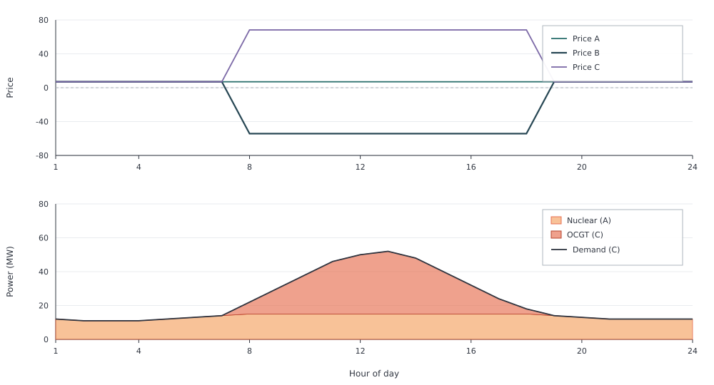
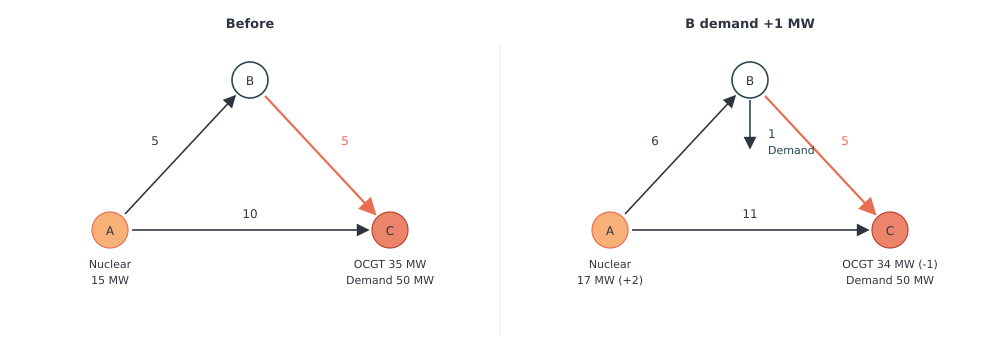

# Negative Locational Prices

This example shows how congestion on a three zone DC power-flow mesh can make
a locational price negative even when every generator has a positive fuel
cost. [DC OPF](dc-opf.md) covers how KVL changes physical flows; here the
same physics sets the nodal prices.

- zone A: a 100 MW Nuclear plant, `fuel_cost=7`
- zone B: a corridor node with no plant and no demand
- zone C: daily demand (11–52 MW) and a 100 MW OCGT plant, `fuel_cost=68.24`
- A–B and C–A: 30 MW each way; B–C: 5 MW each way
- equal susceptance on every AC line (`susceptance=-1`)

```jldoctest negative_prices; output = false
using Posy2
using Nosy
using HiGHS
import JuMP: set_silent

# Simulation and Posy2 input configuration
sim = Sim(Model(HiGHS.Optimizer); mesh=TimeMesh())
set_silent(model(sim))
snapshot = Snapshot(sim, Dict(:posy => Posy2Options(
    tech_mode=:arguments,
    timeseries_mode=:arguments,
)))

# Three electricity zones and a CO2 sink
a = Node("A", EnergyCarrier("electricity A", sim), rule=:default, evalprice=true, tags=[:electricity])
b = Node("B", EnergyCarrier("electricity B", sim), rule=:default, evalprice=true, tags=[:electricity])
c = Node("C", EnergyCarrier("electricity C", sim), rule=:default, evalprice=true, tags=[:electricity])
co2 = Node("CO2", CO2Carrier("CO2", sim), rule=:curtailed, tags=[:co2])

# Daily demand at C only
day = [12.0, 11.0, 11.0, 11.0, 12.0, 13.0, 14.0, 22.0, 30.0, 38.0, 46.0, 50.0, 52.0, 48.0, 40.0, 32.0, 24.0, 18.0, 14.0, 13.0, 12.0, 12.0, 12.0, 12.0]
makedemand("Demand", "C", c, snapshot; profile=repeat(day, 365))

# Nuclear at A and OCGT at C; fuel costs match the technology workbook
makedispatchable("Nuclear", "Nuclear", a, co2, snapshot; cap=100.0, fuel_cost=7.0)
makedispatchable("OCGT", "OCGT", c, co2, snapshot; cap=100.0, fuel_cost=68.24)

# AC triangle: B–C is the tight corridor
maketransmissionlink("IC", a, b, snapshot; cap=30.0, dc=false, susceptance=-1.0)
maketransmissionlink("IC", b, c, snapshot; cap=5.0, dc=false, susceptance=-1.0)
maketransmissionlink("IC", c, a, snapshot; cap=30.0, dc=false, susceptance=-1.0)

# Add KVL on the AC cycle, then minimise operating cost
applydcopf!(snapshot)
optimize!(snapshot, cost(snapshot))
result = extract(snapshot)

# output

Snapshot with 6 component(s) and 3 node(s)

```

With equal susceptances, power sent from A to C splits across the two
available paths: two thirds flows directly on A–C and one third through
A–B–C. The 5 MW limit on B–C therefore limits Nuclear output at A to
15 MW. Once demand at C exceeds 15 MW, Nuclear cannot increase further
even though it still has unused generating capacity, so OCGT at C
supplies the remaining demand.

The results below show two distinct situations. Before B–C
becomes congested, Nuclear is the marginal generator and all three
nodes have a price of 7. Once the line binds, Nuclear remains at 15 MW,
OCGT begins generating, and the nodal prices separate:



```jldoctest negative_prices
julia> dualprice(result.nodes["A"])
8760-element Nosy.Hourly{Float64}:
 7.0
 7.0
 7.0
 7.0
 7.0
 7.0
 7.0
 7.0
 7.0
 7.0
 ⋮
 7.0
 7.0
 7.0
 7.0
 7.0
 7.0
 7.0
 7.0
 7.0

julia> dualprice(result.nodes["B"])
8760-element Nosy.Hourly{Float64}:
   7.0
   7.0
   7.0
   7.0
   7.0
   7.0
   7.0
 -54.239999999999995
 -54.239999999999995
 -54.239999999999995
   ⋮
 -54.239999999999995
 -54.239999999999995
 -54.239999999999995
   7.0
   7.0
   7.0
   7.0
   7.0
   7.0

julia> dualprice(result.nodes["C"])
8760-element Nosy.Hourly{Float64}:
  7.0
  7.0
  7.0
  7.0
  7.0
  7.0
  7.0
 68.24
 68.24
 68.24
  ⋮
 68.24
 68.24
 68.24
  7.0
  7.0
  7.0
  7.0
  7.0
  7.0

julia> balance(result, "Nuclear A", :output, energy; collapse=false, aggregate=true)
8760-element Nosy.Hourly{Float64}:
 12.0
 11.0
 11.0
 11.0
 12.0
 13.0
 14.0
 15.0
 15.0
 15.0
  ⋮
 15.0
 15.0
 15.0
 14.0
 13.0
 12.0
 12.0
 12.0
 12.0

julia> balance(result, "OCGT C", :output, energy; collapse=false, aggregate=true)
8760-element Nosy.Hourly{Float64}:
  0.0
  0.0
  0.0
  0.0
  0.0
  0.0
  0.0
  7.0
 15.0
 23.0
  ⋮
 17.0
  9.0
  3.0
  0.0
  0.0
  0.0
  0.0
  0.0
  0.0
```

The negative price at B can be understood by considering one additional
megawatt of demand at that node. In a congested hour with 50 MW of demand
at C, the left-hand flows hold; adding 1 MW of demand at B gives the
right-hand pattern.



The B–C line remains at its 5 MW limit. Nuclear rises by 2 MW and OCGT falls
by 1 MW, so incremental cost is `2 * 7 − 68.24 = −54.24`. That is the
locational price at B.

Adding demand normally increases system cost. Here it reduces it, because
the extra load at B changes the network flows and lets cheap Nuclear
generation replace expensive OCGT generation. This is why congestion can produce
a negative locational price even when every generator has a positive marginal cost.
