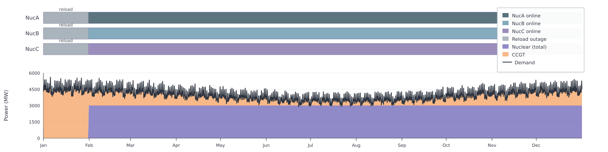
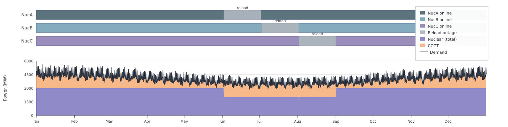

# Nuclear

This example shows how greater flexibility in refuelling schedules can reduce the
backup capacity required by the system. Three [`makenuclear`](@ref) units and a
CCGT backup make that concrete. Unlike gas plants, nuclear units need periodic
refuelling outages (and the maintenance that usually accompanies them). Each
outage lasts many consecutive hours, often weeks in reality. With several
units, when those windows sit relative to each other and to the demand peak
changes how much dispatchable backup the system needs.

Other technologies also have planned outages, but usually for different reasons.
Coal and CCGT plants schedule maintenance. They do not stop for weeks because
they need to reload fuel. Wind, solar, and hydro have no refuelling concept at
all. Posy2 therefore gives nuclear dedicated reload parameters that model this
refuelling outage, rather than a generic maintenance switch shared by every
generator.

Reloading is optional and off by default. This example turns it on. Once it is
on, the yearly outage is fixed in length and must be taken. The optimiser only
chooses when each unit reloads within the allowed starts. The example setup is:

- three 1 000 MW nuclear units
- hourly `country1` demand from the time-series workbook, scaled with
  `coeff=5.5` (peak demand is about 5.67 GW)
- expandable CCGT backup
- a 720-hour reload per unit once reloading is enabled

Scaling keeps the workbook demand shape while raising its magnitude, so the
nuclear fleet covers only part of the peak and reload timing still changes how
much CCGT is built.

This page runs two related studies so that the capacity difference is easy to
read:

1. forced overlap: `reloadmask=8760` leaves only one allowed start, so all
   three units reload together early in the year. That window covers the
   annual peak, and the model builds about 5.67 GW of CCGT.
2. flexible schedule: `reloadmask=730` opens about twelve monthly starts, so
   the optimiser can keep the full fleet online at the peak and limit how
   much the outages overlap. It builds about 2.67 GW of CCGT.

## Forced overlap

With only one allowed reload start in the year (hour 1), every unit must take
that slot, so the three 1 000 MW outages coincide. That early-year window
includes the scaled annual demand peak (about 5.67 GW), nuclear output drops to
0 MW there, and CCGT must cover the full peak.

```jldoctest nuclear_overlap; output = false
using Posy2
using Nosy
using HiGHS
import JuMP: set_silent

# Simulation and Posy2 input configuration
sim = Sim(Model(HiGHS.Optimizer); mesh=TimeMesh())
set_silent(model(sim))
example_data_dir = joinpath(pkgdir(Posy2), "data")
snapshot = Snapshot(sim, Dict(:posy => Posy2Options(
    data_dir=example_data_dir,
    techdata_file="tech_data.xlsx",
    timeseries_file="time_series.xlsx",
    tech_mode=:excel,
    timeseries_mode=:excel,
    discountrate=0.05,
)))

# Electricity node and CO2 sink
electricity = Node("country1", EnergyCarrier("electricity country1", sim), rule=:curtailed, tags=[:electricity])
co2 = Node("CO2", CO2Carrier("CO2", sim), rule=:curtailed, tags=[:co2])

# Workbook demand shape, scaled up so nuclear covers only part of the peak
makedemand("Demand", "country1", electricity, snapshot; coeff=5.5)

# Three fixed 1 GW units with reloading on (720 h each). Only the start hour is chosen.
makenuclear(
    "NucA", "Nuclear", electricity, co2, snapshot;
    cap=1_000.0,
    unit_size=1_000.0,
    uc=true,
    integeruc=true,
    reload_fraction_per_year=1.0,  # >=1 reload per unit per year
    reload_duration=720.0,         # fixed outage length (~30 days), not shortened by the optimiser
    reloadmask=8760,               # only one allowed start (hour 1), so all three coincide
    min_power=0.5,
    min_uptime=24.0,
    min_downtime=24.0,
    startup_duration=1.0,
    shutdown_duration=1.0,
)
makenuclear(
    "NucB", "Nuclear", electricity, co2, snapshot;
    cap=1_000.0,
    unit_size=1_000.0,
    uc=true,
    integeruc=true,
    reload_fraction_per_year=1.0,
    reload_duration=720.0,
    reloadmask=8760,
    min_power=0.5,
    min_uptime=24.0,
    min_downtime=24.0,
    startup_duration=1.0,
    shutdown_duration=1.0,
)
makenuclear(
    "NucC", "Nuclear", electricity, co2, snapshot;
    cap=1_000.0,
    unit_size=1_000.0,
    uc=true,
    integeruc=true,
    reload_fraction_per_year=1.0,
    reload_duration=720.0,
    reloadmask=8760,
    min_power=0.5,
    min_uptime=24.0,
    min_downtime=24.0,
    startup_duration=1.0,
    shutdown_duration=1.0,
)

# Expandable CCGT backup for residual demand
makedispatchable(
    "CCGT", "CCGT", electricity, co2, snapshot;
    maxcap=8_000.0,
    unit_size=0.0,
)

# Minimise total system cost and extract solved values
optimize!(snapshot, cost(snapshot))
result_overlap = extract(snapshot)

# output

Snapshot with 5 component(s) and 2 node(s)
    
```

```jldoctest nuclear_overlap
julia> capacity(result_overlap, "CCGT country1")
5669.201999999999
```

CCGT capacity matches the annual peak: with all three nuclear units offline in
that early window, backup must cover the full scaled demand. The figure shows
the same story in time. Unit outage bars sit on top. Nuclear and CCGT stack
against hourly demand underneath. The three grey reload blocks coincide early
in the year, and CCGT fills the peak inside that window.



## Flexible schedule

Keep the same plants, demand, and costs, but allow about one reload start per
month (roughly twelve options over the year).

```jldoctest nuclear_nonoverlap; output = false
using Posy2
using Nosy
using HiGHS
import JuMP: set_silent

# Simulation and Posy2 input configuration
sim = Sim(Model(HiGHS.Optimizer); mesh=TimeMesh())
set_silent(model(sim))
example_data_dir = joinpath(pkgdir(Posy2), "data")
snapshot = Snapshot(sim, Dict(:posy => Posy2Options(
    data_dir=example_data_dir,
    techdata_file="tech_data.xlsx",
    timeseries_file="time_series.xlsx",
    tech_mode=:excel,
    timeseries_mode=:excel,
    discountrate=0.05,
)))

# Electricity node and CO2 sink
electricity = Node("country1", EnergyCarrier("electricity country1", sim), rule=:curtailed, tags=[:electricity])
co2 = Node("CO2", CO2Carrier("CO2", sim), rule=:curtailed, tags=[:co2])

# Same scaled workbook demand as in the forced case
makedemand("Demand", "country1", electricity, snapshot; coeff=5.5)

# Same three units and 720 h reload. Only the allowed starts change.
makenuclear(
    "NucA", "Nuclear", electricity, co2, snapshot;
    cap=1_000.0,
    unit_size=1_000.0,
    uc=true,
    integeruc=true,
    reload_fraction_per_year=1.0,  # >=1 reload per unit per year
    reload_duration=720.0,         # same fixed outage length as above
    reloadmask=730,                # ~12 allowed starts per year (~monthly)
    min_power=0.5,
    min_uptime=24.0,
    min_downtime=24.0,
    startup_duration=1.0,
    shutdown_duration=1.0,
)
makenuclear(
    "NucB", "Nuclear", electricity, co2, snapshot;
    cap=1_000.0,
    unit_size=1_000.0,
    uc=true,
    integeruc=true,
    reload_fraction_per_year=1.0,
    reload_duration=720.0,
    reloadmask=730,
    min_power=0.5,
    min_uptime=24.0,
    min_downtime=24.0,
    startup_duration=1.0,
    shutdown_duration=1.0,
)
makenuclear(
    "NucC", "Nuclear", electricity, co2, snapshot;
    cap=1_000.0,
    unit_size=1_000.0,
    uc=true,
    integeruc=true,
    reload_fraction_per_year=1.0,
    reload_duration=720.0,
    reloadmask=730,
    min_power=0.5,
    min_uptime=24.0,
    min_downtime=24.0,
    startup_duration=1.0,
    shutdown_duration=1.0,
)

# Same expandable CCGT backup
makedispatchable(
    "CCGT", "CCGT", electricity, co2, snapshot;
    maxcap=8_000.0,
    unit_size=0.0,
)

# Minimise total system cost and extract solved values
optimize!(snapshot, cost(snapshot))
result_nonoverlap = extract(snapshot)

# output

Snapshot with 5 component(s) and 2 node(s)
    
```

```jldoctest nuclear_nonoverlap
julia> capacity(result_nonoverlap, "CCGT country1")
2669.2019999999993
```

The reload duration remains fixed at 720 h for every unit. The scheduling
flexibility comes only from having more possible start times. The optimiser uses
that choice to keep the full nuclear fleet available at the annual demand peak
and to avoid a simultaneous outage of all three units. Required CCGT capacity
therefore falls to about 2.67 GW. The figure shows how the three reload periods
are distributed over the year and how CCGT fills the remaining demand.



Forced reload timing needs about 5.67 GW of CCGT, compared with about 2.67 GW
under a flexible schedule. Both cases impose the same 720-hour refuelling
requirement on every nuclear unit. The difference comes only from when those
outages occur. By choosing their timing, the optimiser reduces the coincidence
of nuclear outages with each other and with high-demand periods, lowering the
backup capacity the system needs to build. The actual scheduling pattern emerges 
from cost minimisation.
