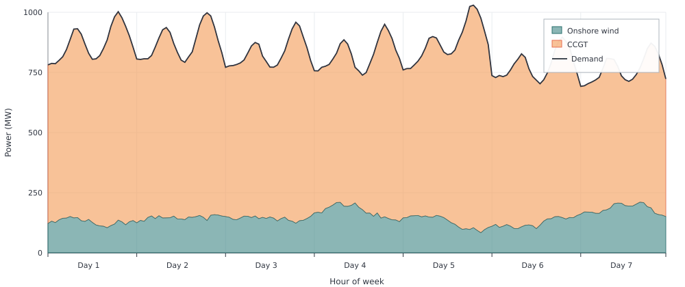

# One Country

The smallest complete Posy2 study: one electricity node with demand, onshore
wind, and a CCGT. Later examples extend the same pattern of Snapshot, `make*`
builders, optimisation, and result inspection.

```jldoctest one_country; output = false
using Posy2
using Nosy
using HiGHS
import JuMP: set_silent

# Generate the simulation and configure Posy2 inputs.
sim = Sim(Model(HiGHS.Optimizer); mesh=TimeMesh())
set_silent(model(sim))
example_data_dir = joinpath(pkgdir(Posy2), "data")
snapshot = Snapshot(
    sim,
    Dict(:posy => Posy2Options(
        data_dir=example_data_dir,
        techdata_file="tech_data.xlsx",
        timeseries_file="time_series.xlsx",
        tech_mode=:excel,
        timeseries_mode=:excel,
        discountrate=0.05,
    )),
)

# Add the electricity and emissions nodes.
# evalprice=true stores electricity node dual prices for reporting.
electricity = Node("country1", EnergyCarrier("electricity country1", sim), rule=:curtailed, evalprice=true, tags=[:electricity])
co2 = Node("CO2", CO2Carrier("CO2", sim), rule=:curtailed, tags=[:co2])

# Hourly electricity demand
makedemand("Demand", "country1", electricity, snapshot)

# Fixed 800 MW wind and continuous CCGT expansion up to 2 GW
makeintermittentsource("Onshore wind", "Onwind", electricity, co2, snapshot; cap=800.0, weatheryear=2019)
makedispatchable("CCGT", "CCGT", electricity, co2, snapshot; maxcap=2_000.0, unit_size=0.0)

# Minimise total system cost and extract solved values
optimize!(snapshot, cost(snapshot))
result = extract(snapshot)

# output

Snapshot with 3 component(s) and 2 node(s)

```

Expected results:

```jldoctest one_country
julia> table(result, capacity)
1×3 DataFrame
 Row │ CCGT country1  Demand country1  Onshore wind country1
     │ Float64        Float64          Float64
─────┼───────────────────────────────────────────────────────
   1 │       889.685              0.0                  800.0
```

Wind capacity is fixed by the builder at 800 MW. The CCGT capacity is optimised
continuously up to `maxcap`, and the optimiser installs about 890 MW so that residual
demand after wind can still be met in every hour.

That capacity choice shows up in the hourly dispatch. Over a sample week from
the solved year, wind (bottom) and CCGT (top) stack to the black demand line:
when wind is strong the CCGT layer shrinks; when wind is weak the CCGT fills
the residual, up to the capacity above.



The annual cost breakdown is:

```jldoctest one_country
julia> costs(result)[:, [:component, :investment, :fuel, :total]]
4×4 DataFrame
 Row │ component              investment  fuel       total
     │ String                 Float64     Float64    Float64
─────┼─────────────────────────────────────────────────────────
   1 │ CCGT country1           5.80805e7  1.90446e8  2.8712e8
   2 │ Demand country1         0.0        0.0        0.0
   3 │ Onshore wind country1   8.16805e7  0.0        1.14258e8
   4 │ all                     1.39761e8  1.90446e8  4.01378e8
```

Write the solved result with [`printsnapshot`](@ref) if you want the
workbook report:

```jldoctest one_country
julia> printsnapshot(result, "one-country.xlsx")
```

That creates `results/one-country.xlsx` with annual indicators, time series,
and price-duration curves. Renaming the node or technology changes which
workbook columns Posy2 reads.
