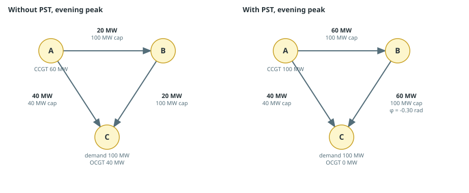
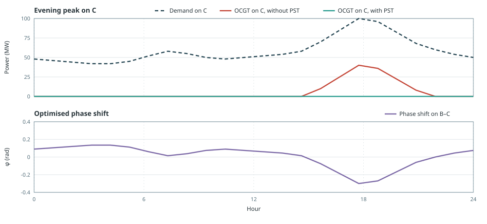

# Phase Shifting Transformer

The same three-zone DC power-flow study, with and without a phase shifting
transformer (PST). Plants, demand, and line capacities do not change. The PST
enlarges the set of flows that satisfy Kirchhoff's voltage law, so a cheaper
dispatch can become available.

- A: cheap CCGT
- B: transit node
- C: demand and an expensive OCGT
- A–B and B–C: 100 MW AC; A–C: 40 MW AC; PST on B–C when used

## Without PST

```jldoctest phase_shift; output = false
using Posy2
using Nosy
using HiGHS
import JuMP: set_silent

# Simulation and Posy2 input configuration
sim = Sim(Model(HiGHS.Optimizer); mesh=TimeMesh())
set_silent(model(sim))
snapshot = Snapshot(sim, Dict(:posy => Posy2Options(
    tech_mode=:arguments,
    timeseries_mode=:arguments,
)))

# Electricity zones: cheap plant on A, transit B, demand and expensive plant on C
a = Node("A", EnergyCarrier("electricity A", sim), rule=:curtailed, evalprice=true, tags=[:electricity])
b = Node("B", EnergyCarrier("electricity B", sim), rule=:curtailed, evalprice=true, tags=[:electricity])
c = Node("C", EnergyCarrier("electricity C", sim), rule=:curtailed, evalprice=true, tags=[:electricity])

# One illustrative day, repeated over the year
day = [48.0, 46.0, 44.0, 42.0, 42.0, 45.0, 52.0, 58.0, 55.0, 50.0, 48.0, 50.0, 52.0, 54.0, 58.0, 70.0, 85.0, 100.0, 96.0, 82.0, 68.0, 60.0, 54.0, 50.0]
makedemand("Demand", "C", c, snapshot; profile=repeat(day, 365))

# Fixed plants; only fuel costs are nonzero
makedispatchable("CCGT", a, snapshot; cap=120.0, fuel_cost=20.0, unit_size=0.0)
makedispatchable("OCGT", c, snapshot; cap=50.0, fuel_cost=80.0, unit_size=0.0)

# AC triangle. The 40 MW A–C corridor is the bottleneck; B–C has no PST here
# Susceptance chosen for a clear illustrative flow split
B = -800 / 3
maketransmissionlink("IC", a, b, snapshot; cap=100.0, susceptance=B, transaction_cost=0.01)
maketransmissionlink("IC", b, c, snapshot; cap=100.0, susceptance=B, transaction_cost=0.01)
maketransmissionlink("IC", a, c, snapshot; cap=40.0, susceptance=B, transaction_cost=0.01)

# Apply KVL, then optimise
applydcopf!(snapshot)
optimize!(snapshot, cost(snapshot))
result = extract(snapshot)

# output

Snapshot with 6 component(s) and 3 node(s)

```

Equal susceptances and a transit node B force the DC split ``f_{AC}=2\,f_{AB}``
when ``\phi=0``. With A–C at its 40 MW rating that is 20 MW on A–B–C, so A
can supply 60 MW. The evening peak is 100 MW, and the OCGT on C covers the
remaining 40 MW.

## With PST

The same study, with `max_phase_shift=0.3` on B–C. The solver chooses an
hourly ``\phi_t`` in ``[-0.3, 0.3]``.

```jldoctest phase_shift; output = false
using Posy2
using Nosy
using HiGHS
import JuMP: set_silent

# Simulation and Posy2 input configuration
sim = Sim(Model(HiGHS.Optimizer); mesh=TimeMesh())
set_silent(model(sim))
snapshot = Snapshot(sim, Dict(:posy => Posy2Options(
    tech_mode=:arguments,
    timeseries_mode=:arguments,
)))

# Same zones as the case without a PST
a = Node("A", EnergyCarrier("electricity A", sim), rule=:curtailed, evalprice=true, tags=[:electricity])
b = Node("B", EnergyCarrier("electricity B", sim), rule=:curtailed, evalprice=true, tags=[:electricity])
c = Node("C", EnergyCarrier("electricity C", sim), rule=:curtailed, evalprice=true, tags=[:electricity])

# Same demand day
day = [48.0, 46.0, 44.0, 42.0, 42.0, 45.0, 52.0, 58.0, 55.0, 50.0, 48.0, 50.0, 52.0, 54.0, 58.0, 70.0, 85.0, 100.0, 96.0, 82.0, 68.0, 60.0, 54.0, 50.0]
makedemand("Demand", "C", c, snapshot; profile=repeat(day, 365))

# Same plants
makedispatchable("CCGT", a, snapshot; cap=120.0, fuel_cost=20.0, unit_size=0.0)
makedispatchable("OCGT", c, snapshot; cap=50.0, fuel_cost=80.0, unit_size=0.0)

# Same AC triangle, with a PST on B–C
# Susceptance chosen for a clear illustrative flow split
B = -800 / 3
maketransmissionlink("IC", a, b, snapshot; cap=100.0, susceptance=B, transaction_cost=0.01)
maketransmissionlink("IC", b, c, snapshot; cap=100.0, susceptance=B, transaction_cost=0.01, max_phase_shift=0.3)
maketransmissionlink("IC", a, c, snapshot; cap=40.0, susceptance=B, transaction_cost=0.01)

# Apply KVL, then optimise
applydcopf!(snapshot)
optimize!(snapshot, cost(snapshot))
result_pst = extract(snapshot)

# output

Snapshot with 6 component(s) and 3 node(s)

```

Line capacities are unchanged. At the same evening peak the long path now
carries 60 MW, A–C stays at 40 MW, and the CCGT on A serves the whole 100 MW.
The OCGT on C stays off.



### Over The Day

Overnight, demand is below 60 MW, so both cases meet it from A and the OCGT
is off. From late afternoon the peak rises above that KVL limited delivery,
and without a PST the OCGT must run. With a PST the extra flow on A–B–C
keeps the OCGT at zero. ``\phi_t`` moves through the day and sits on the
lower bound at the 100 MW hour.



### Cost

Annual generation and operating cost follow that evening difference:

```jldoctest phase_shift
julia> balance(result, "CCGT A", :output, energy; collapse=true, aggregate=true)
462820.0

julia> balance(result, "OCGT C", :output, energy; collapse=true, aggregate=true)
51465.0

julia> cost(result)
1.3379770933333335e7

julia> balance(result_pst, "CCGT A", :output, energy; collapse=true, aggregate=true)
514285.0

julia> balance(result_pst, "OCGT C", :output, energy; collapse=true, aggregate=true)
0.0

julia> cost(result_pst)
1.02924817e7
```

| | Without PST | With PST |
|:---|---:|---:|
| Cheap generation at A (MWh/y) | 462820 | 514285 |
| Expensive generation at C (MWh/y) | 51465 | 0 |
| Total operating cost (currency/year) | 1.338e7 | 1.029e7 |

A PST changes the flows that KVL allows, so the same network can support a
cheaper dispatch.