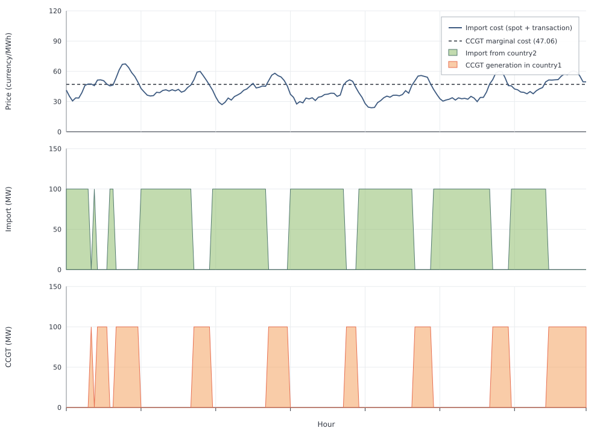

# Price Interconnection

[`makepriceinterco`](@ref) represents an external market with an exogenous
`spot_price` series and user-specified fixed import and export capacities.
It does not create a second electricity node for that market. Here,
`"country2"` is the name used to look up the external market's price and
transfer time series, not a `Node` in the snapshot. Use
[`makenodeinterco`](@ref) when both sides are explicit nodes inside the same
snapshot.

Here flat 100 MW demand faces a domestic CCGT and a priced import link
(export is off). Spot prices and transfer multipliers come from
`time_series.xlsx`. In this example all other variable generation costs are
zero, so the model imports when foreign `spot_price` plus `transactioncost` is
below the CCGT `fuel_cost` of 47.06, and runs the plant otherwise. The
electricity node uses `evalprice=true` so Nosy can return its balance dual
after the solve.

```jldoctest price_interconnection; output = false
using POSY2
using Nosy
using HiGHS
import JuMP: set_silent

sim = Sim(Model(HiGHS.Optimizer); mesh=TimeMesh())
set_silent(model(sim))
example_data_dir = joinpath(pkgdir(POSY2), "data")
snapshot = Snapshot(
    sim,
    Dict(:posy => POSY2Options(
        data_dir=example_data_dir,
        techdata_file="tech_data.xlsx",
        timeseries_file="time_series.xlsx",
        tech_mode=:arguments,
        timeseries_mode=:excel,
    )),
)

electricity = Node("country1", EnergyCarrier("electricity country1", sim), rule=:default, evalprice=true, tags=[:electricity])
co2 = Node("CO2", CO2Carrier("CO2", sim), rule=:curtailed, tags=[:co2])

makedemand("Demand", "country1", electricity, snapshot; coeff=0.0, yearlyconstant=100.0 * 8760)
makedispatchable(
    "CCGT", "CCGT", electricity, co2, snapshot;
    cap=100.0,
    overnight_cost=0.0,
    om_fixed_cost=0.0,
    decommissioning=0.0,
    lifetime=30,
    construction_profile=1.0,
    decommissioning_profile=1.0,
    connection_cost=0.0,
    om_var_cost=0.0,
    fuel_cost=47.06,
    co2_emission=0.0,
    unit_size=0.0,
)
# mcap = 10_000 MW import; xcap = 0 MW export
makepriceinterco("country2", electricity, 10_000.0, 0.0, snapshot; transactioncost=1.0)

optimize!(snapshot, cost(snapshot))
result = extract(snapshot)

# output

Snapshot with 3 component(s) and 1 node(s)

```

Annual totals show that both sources share the flat 100 MW demand
(`376400 + 499600 = 876000 MWh`), but not *when* the model switches:

```jldoctest price_interconnection
julia> balance(result, "IC_country2_country1", :output, energy; collapse=true, aggregate=true)
376400.0

julia> balance(result, "CCGT country1", :output, energy; collapse=true, aggregate=true)
499600.0

julia> cost(result, "IC_country2_country1")
1.42182765e7

julia> cost(result, "CCGT country1")
2.3511176e7
```

The domestic marginal price is the node-balance dual. With
`evalprice=true`, Nosy's `dualprice` reads it from the extracted node. Over the
year it never rises above the CCGT `fuel_cost`. When the plant is on the margin
it sits at `47.06`; when import is cheaper it falls below that line:

```jldoctest price_interconnection
julia> price = dualprice(result.nodes["country1"]);

julia> extrema(price)
(14.095, 47.06)

julia> price[1]   # CCGT supplies hour 1
47.06

julia> round(price[15]; digits=3)   # import supplies hour 15
46.465
```

The week below plots that `dualprice` next to the workbook import cost
(`spot_price + transactioncost`) and the CCGT fuel line, with import and CCGT
dispatch underneath. The chart's `spot_price[t] + transactioncost` is the
workbook series hour by hour. With Nosy's default stepwise `VariableCost`, the
node dual at hour `t` (when import is marginal) is
`0.5 * (spot[t-1] + spot[t]) + transactioncost`, not
`spot[t] + transactioncost`.



`mcap` and `xcap` are fixed capacities multiplied hour by hour by the
`country2>country1` and `country1>country2` columns. The `country2`
`spot_price` column sets the import price; if export capacity were enabled,
the same series would also set export revenue.
