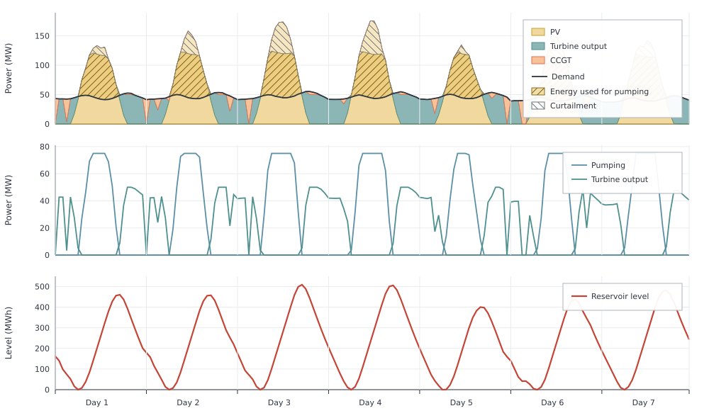

# Pumped Storage

This example shows how pumped storage moves surplus PV to later hours.
Daytime solar exceeds demand on the scaled workbook profile. A plant built with
[`makehydroreservoir`](@ref) pumps that surplus into the reservoir and generates
later on the same electricity node. There is no natural intake. A CCGT covers
hours storage cannot reach. Capacities are fixed. The default `TimeMesh()` is
circular, so the reservoir level wraps from the last hour into the first.
Year-end and year-start are continuous.

```jldoctest pumped_storage; output = false
using Posy2
using Nosy
using HiGHS
import JuMP: set_silent

# Simulation and Posy2 input configuration
sim = Sim(Model(HiGHS.Optimizer); mesh=TimeMesh())
set_silent(model(sim))
example_data_dir = joinpath(pkgdir(Posy2), "data")
snapshot = Snapshot(sim, Dict(:posy => Posy2Options(
    data_dir=example_data_dir,
    techdata_file="tech_data.xlsx",
    timeseries_file="time_series.xlsx",
    tech_mode=:arguments,
    timeseries_mode=:excel,
)))

# Electricity node and CO2 sink
electricity = Node("country1", EnergyCarrier("electricity country1", sim), rule=:curtailed, tags=[:electricity])
co2 = Node("CO2", CO2Carrier("CO2", sim), rule=:curtailed, tags=[:co2])

# Workbook country1 demand scaled to about 50 MW on average
makedemand("Demand", "country1", electricity, snapshot; profile_multiplier=0.068)

# Fixed 200 MW PV
makeintermittentsource(
    "Solar", electricity, snapshot; co2_node=co2, tech_column="PV",
    cap=200.0,
    weather_year=2019,
)

# Fixed 50 MW CCGT backup for hours storage cannot cover
makedispatchable(
    "CCGT", electricity, snapshot; co2_node=co2, tech_column="CCGT",
    cap=50.0,
    overnight_cost=955.0,
    decommissioning=0.05,
    lifetime=30,
    construction_profile=fill(1 / 3, 3),
    decommissioning_profile=[0.5, 0.5],
    om_var_cost=6.99,
    fuel_cost=47.06,
    co2_emission=348.0,
)

# Fixed pumped storage: 50 MW turbine, 75 MW pumping, 80% round-trip, no natural intake
makehydroreservoir(
    "Pumped hydro",
    "country1",
    electricity,
    snapshot; tech_column="Hydro res",
    discharge_cap=50.0,     # turbine capacity
    charge_cap=75.0,        # pumping capacity
    intake=0.0,             # no natural intake
    energy_cap=12_000.0,    # fixed reservoir energy capacity
    roundtrip_eff=0.8,
)

# Minimise total system cost and extract solved values
optimize!(snapshot, cost(snapshot))
result = extract(snapshot)

# output

Snapshot with 4 component(s) and 2 node(s)

```

Over the year, turbine generation is 80% of the electricity used for pumping.
That matches the stated round-trip efficiency. The gap is storage loss.

```jldoctest pumped_storage
julia> pump = balance(result, "Pumped hydro country1", :input, energy; collapse=true, aggregate=true)
104232.12827599999

julia> turbine = balance(result, "Pumped hydro country1", :output, energy; collapse=true, aggregate=true)
83385.7026208

julia> turbine / pump
0.7999999999999997
```

In the figure, daytime PV rises above demand. The first hatched band above the
demand line is electricity used for pumping. Pumping is limited to 75 MW, so any
further PV surplus is curtailed in the second hatched band. The reservoir level
rises while that water is stored. Later the turbine releases it, limited to
50 MW, and the level falls. CCGT fills hours that storage still cannot cover:


