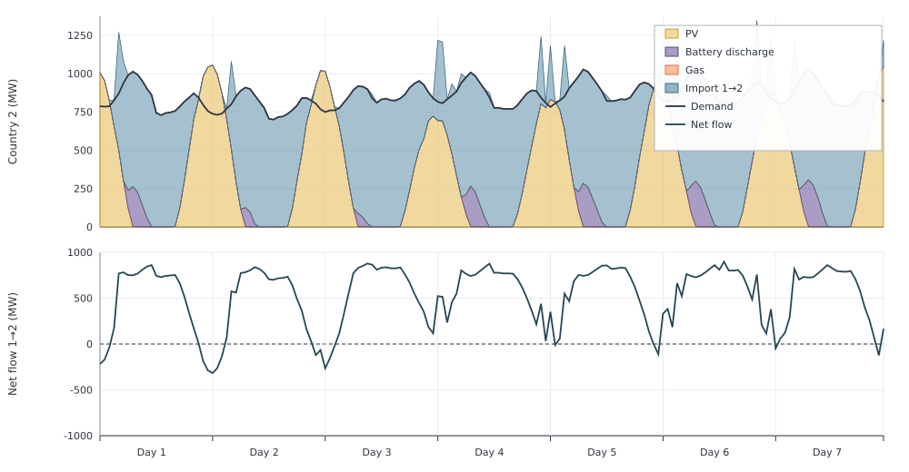
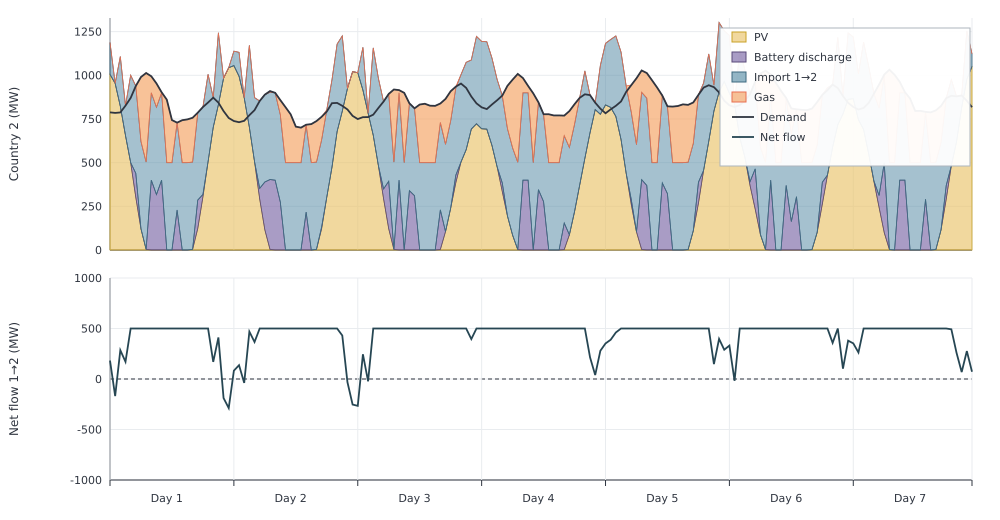

# Two Countries

Two electricity regions trade across a [`maketransmissionlink`](@ref) link:

- Country 1: demand and a large cheap CCGT
- Country 2: demand, PV, battery, and an expensive gas peaker
- Interconnection: node link compared with nonbinding 10 GW and binding 500 MW capacities

The interconnection moves energy from country 1 to country 2 most of the year;
daytime PV on country 2 can reverse a slice of that flow.

Capacities are fixed and all costs except fuel costs are set to zero, 
keeping the example focused on dispatch and trade.

```jldoctest two_countries; output = false
using Posy2
using Nosy
using HiGHS
import JuMP: set_silent

# Simulation and Posy2 input configuration
sim = Sim(Model(HiGHS.Optimizer); mesh=TimeMesh())
set_silent(model(sim))
example_data_dir = joinpath(pkgdir(Posy2), "data")
snapshot = Snapshot(sim, Dict(:posy => Posy2Options(
    data_dir=example_data_dir,
    techdata_file="tech_data.xlsx",
    timeseries_file="time_series.xlsx",
    tech_mode=:arguments,
    timeseries_mode=:excel,
)))

# Electricity nodes for both countries and the CO2 emissions sink
country1 = Node("country1", EnergyCarrier("electricity country1", sim), rule=:curtailed, evalprice=true, tags=[:electricity])
country2 = Node("country2", EnergyCarrier("electricity country2", sim), rule=:curtailed, evalprice=true, tags=[:electricity])
co2 = Node("CO2", CO2Carrier("CO2", sim), rule=:curtailed, tags=[:co2])

# Hourly electricity demand in both countries
makedemand("Demand", "country1", country1, snapshot)
makedemand("Demand", "country2", country2, snapshot)

# Country 1: 1.5 GW low cost CCGT
makedispatchable(
    "CCGT", country1, snapshot; co2_node=co2,
    cap=1500.0,
    fuel_cost=47.06,
)

# Country 2: 1.2 GW PV
makeintermittentsource(
    "Solar", country2, snapshot; co2_node=co2, tech_column="PV",
    cap=1200.0,
    weather_year=2019,
)

# Country 2: 400 MW, 4 hour duration battery
makebatterystorage(
    "Battery", country2, snapshot;
    power_cap=400.0,
    roundtrip_eff=0.85,
    duration=4.0,
)

# Country 2: 1 GW Gas
makedispatchable(
    "Gas", country2, snapshot; co2_node=co2, tech_column="Gas",
    cap=1000.0,
    fuel_cost=90.0,
)

# Nonbinding 10 GW bidirectional interconnection
maketransmissionlink(
    "IC", country1, country2, snapshot;
    cap=10_000.0,
    atob_availability=1.0,
    btoa_availability=1.0,
)

# Minimise total system cost and extract solved values
optimize!(snapshot, cost(snapshot))
result = extract(snapshot)

# output

Snapshot with 7 component(s) and 2 node(s)

```

Annual generation already separates the two countries' plants. Country 1's cheap
CCGT runs hard; country 2's free PV and battery discharge cover part of its
load, and expensive gas fills only a residual:

```jldoctest two_countries
julia> balance(result, "CCGT country1", :output, energy; collapse=true, aggregate=true)
1.2296100731717668e7

julia> balance(result, "Solar country2", :output, energy; collapse=true, aggregate=true)
1.6419079848000023e6

julia> balance(result, "Battery country2", :output, energy; collapse=true, aggregate=true)
341063.21817999927

julia> balance(result, "Gas country2", :output, energy; collapse=true, aggregate=true)
1.149265248220001e6
```

A sample week on country 2 shows both nights dominated by imports and daytime reverse exports. The upper panel stacks PV, battery discharge, and imports against
demand. Gas remains off during this week. Supply above demand is used for
battery charging or reverse exports. The lower panel shows net interconnection
flow: positive values are imports from country 1, while negative values are
reverse exports from country 2.



To inspect annual trade in each direction, call `balance` with
`aggregate=false`. For this interconnection, `input` is the flow from country 1
to country 2 and `input2` is the reverse flow:

```jldoctest two_countries
julia> annual_trade = balance(result, "IC_country1_country2", :input, energy; collapse=true, aggregate=false)
Dict{String, Float64} with 2 entries:
  "input"  => 5.87087e6
  "input2" => 14275.7

julia> annual_trade["input"] - annual_trade["input2"]
5.856596189717646e6
```
Although the flow reverses during some sunny hours, country 1 exports about
5.86 TWh net over the year.


## 500 MW transmission limit

Transfers from country 1 to country 2 exceed 500 MW in the unlimited case. Repeating
the same study with 500 MW in each direction makes that transfer limit bind.

```jldoctest two_countries; output = false
using Posy2
using Nosy
using HiGHS
import JuMP: set_silent

# Simulation and Posy2 input configuration
sim = Sim(Model(HiGHS.Optimizer); mesh=TimeMesh())
set_silent(model(sim))
example_data_dir = joinpath(pkgdir(Posy2), "data")
snapshot = Snapshot(sim, Dict(:posy => Posy2Options(
    data_dir=example_data_dir,
    techdata_file="tech_data.xlsx",
    timeseries_file="time_series.xlsx",
    tech_mode=:arguments,
    timeseries_mode=:excel,
)))

# Electricity nodes for both countries and the CO2 emissions sink
country1 = Node("country1", EnergyCarrier("electricity country1", sim), rule=:curtailed, evalprice=true, tags=[:electricity])
country2 = Node("country2", EnergyCarrier("electricity country2", sim), rule=:curtailed, evalprice=true, tags=[:electricity])
co2 = Node("CO2", CO2Carrier("CO2", sim), rule=:curtailed, tags=[:co2])

# Hourly electricity demand in both countries
makedemand("Demand", "country1", country1, snapshot)
makedemand("Demand", "country2", country2, snapshot)

# Country 1: 1.5 GW low cost CCGT
makedispatchable(
    "CCGT", country1, snapshot; co2_node=co2, tech_column="CCGT",
    cap=1500.0,
    fuel_cost=47.06,
)

# Country 2: 1.2 GW PV
makeintermittentsource(
    "Solar", country2, snapshot; co2_node=co2, tech_column="PV",
    cap=1200.0,
    weather_year=2019,
)

# Country 2: 400 MW, 4 hour duration battery
makebatterystorage(
    "Battery", country2, snapshot; tech_column="Battery",
    power_cap=400.0,
    roundtrip_eff=0.85,
    duration=4.0,
)

# Country 2: 1 GW Gas
makedispatchable(
    "Gas", country2, snapshot; co2_node=co2, tech_column="Gas",
    cap=1000.0,
    fuel_cost=90.0,
)

# Limit transfers to 500 MW in each direction at full availability
maketransmissionlink(
    "IC", country1, country2, snapshot;
    cap=500.0,
    atob_availability=1.0,
    btoa_availability=1.0,
)

# Minimise total system cost and extract solved values
optimize!(snapshot, cost(snapshot))
result_limited = extract(snapshot)

# output

Snapshot with 7 component(s) and 2 node(s)

```

The 500 MW limit prevents country 2 from importing all of the lower-cost
electricity available from country 1. During hours when the unlimited case
would import more than 500 MW, the interconnection becomes saturated.
Country 2 must then run its higher cost gas plant to meet the remaining
demand. Over the same hours as the unlimited case, this appears as a flat
500 MW segment in the lower panel and a larger orange gas area in the upper
panel:



The hourly flows confirm that the limit binds:

```jldoctest two_countries
julia> unlimited_trade = balance(result, "IC_country1_country2", :input, energy; collapse=false, aggregate=false);

julia> limited_trade = balance(result_limited, "IC_country1_country2", :input, energy; collapse=false, aggregate=false);

julia> maximum(unlimited_trade["input"] .- unlimited_trade["input2"])
930.716

julia> maximum(limited_trade["input"] .- limited_trade["input2"])
500.0
```

This congestion raises country 2's annual gas generation from about 1.15 TWh
to 2.73 TWh:

```jldoctest two_countries
julia> balance(result, "Gas country2", :output, energy; collapse=true, aggregate=true)
1.149265248220001e6

julia> balance(result_limited, "Gas country2", :output, energy; collapse=true, aggregate=true)
2.730122789995005e6
```

The transmission limit therefore shifts generation from lower cost CCGT in
country 1 to higher cost gas in country 2.
